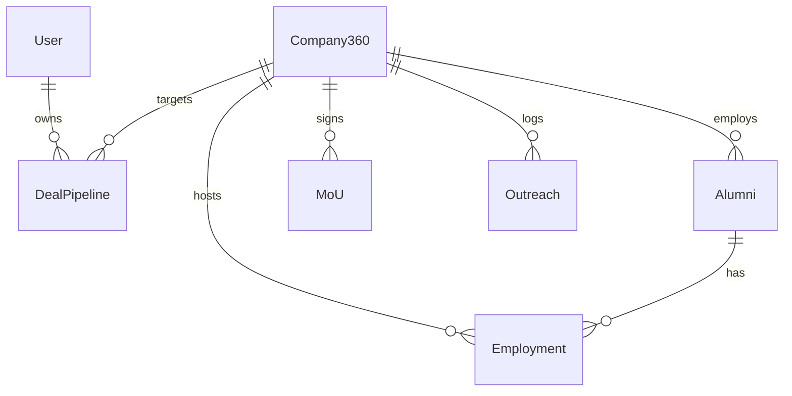

# EduBridge Enterprise — Low-Level Design (LLD) v2.0

> **Owner**: TrailBlazers  
> **Stack**: PostgreSQL (via Supabase) | Express.js 5.x | Node.js 20 | Prisma ORM  
> **Audience**: Backend Development Team

---

## Table of Contents

1. [Database Schema](#1-database-schema)
2. [API Endpoint Contract](#2-api-endpoint-contract)
3. [Security & RBAC](#3-security--rbac)
4. [Module Inventory](#4-module-inventory)

---

## 1. Database Schema

The schema is managed via **Prisma ORM** against **PostgreSQL 15+** (hosted on Supabase). All models use either `Int` (autoincrement) or `String` (UUID v4) primary keys. Timestamps use `Timestamptz(6)`. Soft-delete is implemented via a nullable `deletedAt` column.

### 1.1 Entity Definitions

#### `User`

Stores system actors (Admin, TPO, Coordinator, HOD). The `role` enum drives access control.

| Column | Type | Constraints | Description |
|--------|------|-------------|-------------|
| `id` | `Int` | `PK, autoincrement` | Surrogate key |
| `name` | `VARCHAR(255)` | `NOT NULL` | Display name |
| `email` | `VARCHAR(255)` | `UNIQUE, NOT NULL` | Login identifier |
| `password` | `VARCHAR(255)` | `NOT NULL` | bcrypt hash |
| `role` | `UserRole` enum | `NOT NULL, DEFAULT 'coordinator'` | `admin \| tpo \| coordinator \| hod` |
| `resetToken` | `VARCHAR(255)` | | Password reset token |
| `resetTokenExpiry` | `TIMESTAMPTZ(6)` | | Reset token expiry |
| `otp` | `VARCHAR(255)` | | One-time password for reset |
| `otpExpiry` | `TIMESTAMPTZ(6)` | | OTP expiry |
| `createdAt` | `TIMESTAMPTZ(6)` | `NOT NULL` | |
| `updatedAt` | `TIMESTAMPTZ(6)` | `NOT NULL` | |

**Relations:** `deals` → `DealPipeline[]`

**Map:** `Users`

---

#### `Company360`

Central repository for corporate entities tracked by the TPO cell. Includes CRM pipeline status, partnership levels, relationship stages, health scoring, and aggregated placement counters.

| Column | Type | Constraints | Description |
|--------|------|-------------|-------------|
| `id` | `UUID` | `PK` | |
| `companyCode` | `VARCHAR(20)` | `UNIQUE, NOT NULL` | Internal code |
| `companyName` | `VARCHAR(255)` | `UNIQUE, NOT NULL` | Legal name |
| `industry` | `CompanyIndustry` enum | `NOT NULL` | `IT \| Finance \| Healthcare \| Manufacturing \| Education \| Consulting \| Telecommunication \| E_Commerce \| Automobile \| Construction \| Other` |
| `website` | `VARCHAR(255)` | | |
| `email` | `VARCHAR(255)` | | |
| `phone` | `VARCHAR(20)` | | |
| `linkedin` | `VARCHAR(255)` | | LinkedIn URL |
| `headOffice` | `VARCHAR(255)` | | HQ address |
| `city` | `VARCHAR(255)` | | |
| `country` | `VARCHAR(255)` | `DEFAULT 'India'` | |
| `postalCode` | `VARCHAR(15)` | | |
| `companySize` | `CompanySize` enum | | `1-50 \| 51-200 \| 201-500 \| 501-1000 \| 1000+` |
| `foundedYear` | `Int` | | |
| `description` | `TEXT` | | |
| `status` | `CompanyStatus` enum | `DEFAULT 'PROSPECT'` | `ACTIVE \| INACTIVE \| PROSPECT \| BLACKLISTED` |
| `partnershipLevel` | `PartnershipLevel` enum | `DEFAULT 'NONE'` | `NONE \| BASIC \| PREMIUM \| STRATEGIC` |
| `relationshipStage` | `RelationshipStage` enum | `DEFAULT 'Cold_Lead'` | 10-stage pipeline from Cold Lead to Strategic Partner |
| `healthScore` | `Int` | `DEFAULT 0` | Computed or manual score (0-100) |
| `nextFollowUpDate` | `TIMESTAMPTZ(6)` | | Scheduled follow-up |
| `totalPlacements` | `Int` | `DEFAULT 0` | Aggregate counter |
| `totalOffers` | `Int` | `DEFAULT 0` | Aggregate counter |
| `totalVisits` | `Int` | `DEFAULT 0` | Aggregate counter |
| `totalMoUs` | `Int` | `DEFAULT 0` | Aggregate counter |
| `createdBy` | `UUID` | | Actor who created |
| `updatedBy` | `UUID` | | Actor who last updated |
| `isActive` | `Boolean` | `DEFAULT true` | Active flag |
| `createdAt` | `TIMESTAMPTZ(6)` | `NOT NULL` | |
| `updatedAt` | `TIMESTAMPTZ(6)` | `NOT NULL` | |
| `deletedAt` | `TIMESTAMPTZ(6)` | | Soft-delete timestamp |

**Relations:** `alumni[]`, `deals[]`, `mous[]`, `outreaches[]`, `employments[]`

**Indexes:** `city`, `healthScore`, `industry`, `nextFollowUpDate`, `partnershipLevel`, `relationshipStage`, `status`

**Map:** `company360`

---

#### `Alumni`

Directory of graduated students mapped to their current employment. Supports influence scoring, skills tracking, and outreach targeting.

| Column | Type | Constraints | Description |
|--------|------|-------------|-------------|
| `id` | `UUID` | `PK` | |
| `alumniCode` | `VARCHAR(20)` | `UNIQUE, NOT NULL` | Internal alumni code |
| `fullName` | `VARCHAR(255)` | `NOT NULL` | |
| `email` | `VARCHAR(255)` | `UNIQUE, NOT NULL` | |
| `phone` | `VARCHAR(20)` | | |
| `department` | `VARCHAR(100)` | `NOT NULL` | Graduating department |
| `batchYear` | `Int` | `NOT NULL` | Graduating year |
| `currentDesignation` | `VARCHAR(150)` | `NOT NULL` | Current job title |
| `seniorityLevel` | `AlumniSeniorityLevel` enum | `DEFAULT 'Entry_Level'` | `Entry_Level \| Mid_Level \| Senior_Level \| Lead \| Manager \| Director \| Founder \| HR \| Other` |
| `companyId` | `UUID` | `FK → Company360.id` | Current employer |
| `linkedin` | `VARCHAR(255)` | | LinkedIn profile URL |
| `location` | `VARCHAR(255)` | | Current city |
| `skills` | `JSON` | `DEFAULT '[]'` | Array of skill strings |
| `willingnessToHelp` | `AlumniWillingnessToHelp` enum | `DEFAULT 'Maybe'` | `Yes \| No \| Maybe` |
| `helpTypes` | `JSON` | `DEFAULT '[]'` | Types of help alumni can offer |
| `influenceScore` | `Int` | `DEFAULT 0` | 0-100 influence metric |
| `relationshipScore` | `Int` | `DEFAULT 0` | 0-100 relationship metric |
| `lastContactedAt` | `TIMESTAMPTZ(6)` | | Last outreach timestamp |
| `status` | `AlumniStatus` enum | `DEFAULT 'Active'` | `Active \| Inactive \| Not_Reachable` |
| `notes` | `TEXT` | | Internal notes |
| `createdAt` | `TIMESTAMPTZ(6)` | `NOT NULL` | |
| `updatedAt` | `TIMESTAMPTZ(6)` | `NOT NULL` | |

**Relations:** `company → Company360`, `employments → Employment[]`

**Indexes:** `companyId`

**Map:** `alumni`

---

#### `DealPipeline`

Tracks opportunities with companies through a multi-stage sales pipeline from cold lead to strategic partnership. Each deal is owned by a User and linked to a Company360 record.

| Column | Type | Constraints | Description |
|--------|------|-------------|-------------|
| `id` | `UUID` | `PK` | |
| `dealCode` | `VARCHAR(20)` | `UNIQUE, NOT NULL` | Internal deal code |
| `companyId` | `UUID` | `FK → Company360.id, NOT NULL` | Target company |
| `title` | `VARCHAR(255)` | `NOT NULL` | Deal title |
| `ownerId` | `Int` | `FK → User.id, NOT NULL` | TPO/coordinator owning the deal |
| `stage` | `DealStage` enum | `DEFAULT 'Cold_Lead'` | 13-stage pipeline |
| `priority` | `DealPriority` enum | `DEFAULT 'Medium'` | `Low \| Medium \| High \| Critical` |
| `probability` | `Int` | `DEFAULT 10` | Win probability % |
| `expectedStudents` | `Int` | `DEFAULT 0` | Expected hire count |
| `expectedCTC` | `DECIMAL(10,2)` | | Expected salary package |
| `expectedHiringDate` | `DATE` | | Target hiring date |
| `source` | `DealSource` enum | `DEFAULT 'Other'` | Lead source |
| `leadOwner` | `VARCHAR(255)` | | External lead owner name |
| `decisionMaker` | `VARCHAR(255)` | | Company decision maker |
| `decisionMakerEmail` | `VARCHAR(255)` | | |
| `decisionMakerPhone` | `VARCHAR(255)` | | |
| `lastActivityDate` | `TIMESTAMPTZ(6)` | | Last activity timestamp |
| `nextFollowUpDate` | `TIMESTAMPTZ(6)` | | Scheduled next action |
| `nextAction` | `VARCHAR(255)` | | Description of next action |
| `meetingDate` | `TIMESTAMPTZ(6)` | | Scheduled meeting |
| `proposalSentDate` | `TIMESTAMPTZ(6)` | | Proposal sent date |
| `mouExpectedDate` | `TIMESTAMPTZ(6)` | | Expected MoU signing |
| `closeDate` | `TIMESTAMPTZ(6)` | | Deal close date |
| `lostReason` | `TEXT` | | Reason if lost |
| `competitorCollege` | `VARCHAR(255)` | | Competing institution |
| `riskLevel` | `DealRiskLevel` enum | `DEFAULT 'Low'` | `Low \| Medium \| High` |
| `remarks` | `TEXT` | | Internal remarks |
| `isArchived` | `Boolean` | `DEFAULT false` | Archived flag |
| `createdBy` | `UUID` | | |
| `updatedBy` | `UUID` | | |
| `createdAt` | `TIMESTAMPTZ(6)` | `NOT NULL` | |
| `updatedAt` | `TIMESTAMPTZ(6)` | `NOT NULL` | |
| `deletedAt` | `TIMESTAMPTZ(6)` | | Soft-delete |

**Relations:** `company → Company360`, `owner → User`

**Indexes:** `companyId`, `expectedHiringDate`, `nextFollowUpDate`, `ownerId`, `priority`, `probability`, `stage`

**Map:** `deal_pipeline`

---

#### `MoU`

Digital Memorandum of Understanding records tracking agreements between the institution and corporate partners.

| Column | Type | Constraints | Description |
|--------|------|-------------|-------------|
| `id` | `UUID` | `PK` | |
| `companyId` | `UUID` | `FK → Company360.id, NOT NULL` | Partner company |
| `mouNumber` | `VARCHAR(50)` | `UNIQUE, NOT NULL` | Reference number |
| `title` | `VARCHAR(255)` | `NOT NULL` | MoU title |
| `purpose` | `TEXT` | | Description of purpose |
| `startDate` | `DATE` | `NOT NULL` | Effective start |
| `endDate` | `DATE` | `NOT NULL` | Expiry date |
| `signedDate` | `DATE` | `NOT NULL` | Date signed |
| `status` | `MoUStatus` enum | `DEFAULT 'DRAFT'` | `DRAFT \| PENDING \| ACTIVE \| EXPIRED \| TERMINATED \| RENEWED` |
| `collaborationType` | `CollaborationType` enum | `NOT NULL` | `PLACEMENTS \| INTERNSHIPS \| TRAINING \| RESEARCH \| CONSULTANCY \| INDUSTRY_VISIT \| WORKSHOP \| MULTIPLE \| OTHER` |
| `signedByCompany` | `VARCHAR(255)` | | Company signatory name |
| `signedByInstitute` | `VARCHAR(255)` | | Institute signatory name |
| `renewalReminderDays` | `Int` | `DEFAULT 30` | Days before expiry to trigger reminder |
| `documentUrl` | `VARCHAR(255)` | | Link to signed PDF |
| `remarks` | `TEXT` | | |
| `createdBy` | `UUID` | | |
| `updatedBy` | `UUID` | | |
| `isActive` | `Boolean` | `DEFAULT true` | |
| `createdAt` | `TIMESTAMPTZ(6)` | `NOT NULL` | |
| `updatedAt` | `TIMESTAMPTZ(6)` | `NOT NULL` | |
| `deletedAt` | `TIMESTAMPTZ(6)` | | Soft-delete |

**Relations:** `company → Company360`

**Indexes:** `collaborationType`, `companyId`, `endDate`, `status`

**Map:** `mous`

---

#### `Outreach`

Logs every touchpoint with a company — emails, calls, meetings, visits, and other interactions. Functions as an interaction history log (not a queued email system in V1).

| Column | Type | Constraints | Description |
|--------|------|-------------|-------------|
| `id` | `UUID` | `PK` | |
| `companyId` | `UUID` | `FK → Company360.id, NOT NULL` | Target company |
| `outreachType` | `OutreachType` enum | `NOT NULL` | `EMAIL \| PHONE_CALL \| MEETING \| LINKEDIN \| VISIT \| EVENT \| PLACEMENT_DRIVE \| INTERNSHIP \| MOU_DISCUSSION \| FOLLOW_UP \| OTHER` |
| `subject` | `VARCHAR(255)` | `NOT NULL` | Subject line |
| `description` | `TEXT` | | Body / notes |
| `interactionDate` | `TIMESTAMPTZ(6)` | `NOT NULL` | When the interaction occurred |
| `outcome` | `OutreachOutcome` enum | `DEFAULT 'NEUTRAL'` | `POSITIVE \| NEUTRAL \| NEGATIVE \| NO_RESPONSE \| FOLLOW_UP_REQUIRED` |
| `status` | `OutreachStatus` enum | `DEFAULT 'PLANNED'` | `PLANNED \| COMPLETED \| CANCELLED \| MISSED` |
| `nextFollowUpDate` | `TIMESTAMPTZ(6)` | | Scheduled next outreach |
| `notes` | `TIMESTAMPTZ(6)` | | Free-form notes |
| `createdBy` | `UUID` | `NOT NULL` | |
| `updatedBy` | `UUID` | | |
| `isActive` | `Boolean` | `DEFAULT true` | |
| `createdAt` | `TIMESTAMPTZ(6)` | `NOT NULL` | |
| `updatedAt` | `TIMESTAMPTZ(6)` | `NOT NULL` | |
| `deletedAt` | `TIMESTAMPTZ(6)` | | Soft-delete |

**Relations:** `company → Company360`

**Indexes:** `companyId`, `interactionDate`, `nextFollowUpDate`, `outcome`, `status`

**Map:** `outreaches`

---

#### `Employment`

Tracks alumni employment history — current and past positions at companies.

| Column | Type | Constraints | Description |
|--------|------|-------------|-------------|
| `id` | `UUID` | `PK` | |
| `alumniId` | `UUID` | `FK → Alumni.id, NOT NULL` | Alumni record |
| `companyId` | `UUID` | `FK → Company360.id, NOT NULL` | Employer |
| `designation` | `VARCHAR(255)` | `NOT NULL` | Job title |
| `department` | `VARCHAR(100)` | | Department |
| `startDate` | `DATE` | `NOT NULL` | Start date |
| `endDate` | `DATE` | | End date (null if current) |
| `isCurrent` | `Boolean` | `DEFAULT true` | Currently employed here |
| `employmentType` | `EmploymentType` enum | `DEFAULT 'FULL_TIME'` | `FULL_TIME \| PART_TIME \| CONTRACT \| INTERNSHIP` |
| `workMode` | `WorkMode` enum | `DEFAULT 'ON_SITE'` | `ON_SITE \| REMOTE \| HYBRID` |
| `location` | `VARCHAR(255)` | | Work location |
| `description` | `TEXT` | | Role description |
| `remarks` | `TEXT` | | |
| `createdAt` | `TIMESTAMPTZ(6)` | `NOT NULL` | |
| `updatedAt` | `TIMESTAMPTZ(6)` | `NOT NULL` | |

**Relations:** `alumni → Alumni`, `company → Company360`

**Indexes:** `alumniId`, `companyId`, `(alumniId, isCurrent)`, `(companyId, isCurrent)`

**Map:** `employment`

---

### 1.2 Entity Relationship Diagram



---

## 2. API Endpoint Contract

### 2.1 Standardised Response Envelope

All API responses follow a consistent JSON envelope:

```json
{
    "success": true,
    "data": { ... },
    "pagination": {
        "page": 1,
        "limit": 20,
        "total": 142,
        "totalPages": 8
    },
    "message": null
}
```

On error:

```json
{
    "success": false,
    "data": null,
    "message": "Human-readable error description"
}
```

HTTP status codes: `200` (success), `201` (created), `400` (validation), `401` (unauthenticated), `403` (forbidden), `404` (not found), `409` (conflict), `500` (internal).

---

### 2.2 Mounted Modules (active in server.js)

#### Module: Auth

Base path: `/auth`

| Method | Endpoint | Auth | Request Body | Success Response | Notes |
|--------|----------|------|-------------|------------------|-------|
| `GET` | `/` | No | — | `{ message }` | Server health |
| `GET` | `/health` | No | — | `{ status }` | Health check |
| `POST` | `/login` | No | `{ email, password }` | `{ token, user }` | Returns JWT |
| `POST` | `/forgot-password` | No | `{ email }` | `{ message }` | Sends OTP via email |
| `POST` | `/create_user` | Yes (admin) | `{ name, email, password, role }` | `{ message, user }` | Admin-only |
| `POST` | `/verify-otp` | No | `{ email, otp }` | `{ token }` | Returns short-lived reset token |
| `POST` | `/reset-password` | No (Bearer reset token) | `{ newPassword }` | `{ message }` | Requires reset JWT in header |

#### Module: Analytics

Base path: `/analytics`

| Method | Endpoint | Auth | Description |
|--------|----------|------|-------------|
| `GET` | `/dashboard` | No | Returns aggregate counts for companies (total/active/prospect/inactive), MoUs, outreaches, health score average, industry breakdown, status breakdown |

#### Module: Company360

Base path: `/api/company360`

| Method | Endpoint | Auth | Request / Query | Description |
|--------|----------|------|----------------|-------------|
| `POST` | `/` | No | `{ companyName, industry, ... }` | Create new company |
| `GET` | `/` | No | `?page, limit, search, industry, status, city, sortBy, sortOrder, includeDeleted` | List companies (paginated, filterable) |
| `GET` | `/:id` | No | `?includeDeleted` | Get company by ID |
| `GET` | `/:id/details` | No | — | Get company with relations |
| `GET` | `/:id/statistics` | No | — | Get aggregated stats |
| `PUT` | `/:id` | No | `{ companyName, industry, ... }` | Update company |
| `DELETE` | `/:id/restore` | No | — | Restore soft-deleted company |
| `DELETE` | `/:id/permanently-delete` | No | — | Hard delete |

---

### 2.3 Unmounted Modules (controllers exist, not wired in server.js)

The following controllers implement full CRUD but are **not yet mounted** in `server.js`. Their endpoints are specified below for reference — they become active once their route file is imported and registered.

#### Module: Alumni (controller: `alumni.js`)

| Method | Endpoint | Description |
|--------|----------|-------------|
| `POST` | `/api/alumni` | Create alumni |
| `GET` | `/api/alumni` | List alumni (paginated, filterable) |
| `GET` | `/api/alumni/:id` | Get by ID |
| `GET` | `/api/alumni/code/:alumniCode` | Get by alumni code |
| `GET` | `/api/alumni/email/:email` | Get by email |
| `GET` | `/api/alumni/company/:companyId` | Get by company |
| `PUT` | `/api/alumni/:id` | Update alumni |
| `PUT` | `/api/alumni/:id/assign-company` | Assign to company |
| `DELETE` | `/api/alumni/:id/remove-company` | Remove company assignment |
| `PUT` | `/api/alumni/:id/scores` | Update influence/relationship scores |
| `POST` | `/api/alumni/:id/contact` | Record contact |
| `POST` | `/api/alumni/:id/skills` | Add skills |
| `DELETE` | `/api/alumni/:id/skills` | Remove skill |
| `PUT` | `/api/alumni/:id/help-preferences` | Update willingness to help |
| `PUT` | `/api/alumni/:id/status` | Change status |
| `PUT` | `/api/alumni/:id/activate` | Activate |
| `PUT` | `/api/alumni/:id/deactivate` | Deactivate |
| `DELETE` | `/api/alumni/:id` | Permanently delete |
| `GET` | `/api/alumni/statistics` | Get aggregate statistics |

#### Module: MoU (controller: `mouvoult.js`)

| Method | Endpoint | Description |
|--------|----------|-------------|
| `POST` | `/api/mous` | Create MoU |
| `GET` | `/api/mous` | List MoUs (paginated, filterable) |
| `GET` | `/api/mous/:id` | Get by ID |
| `GET` | `/api/mous/company/:companyId` | Get by company |
| `PUT` | `/api/mous/:id` | Update MoU |
| `PUT` | `/api/mous/:id/status` | Change status |
| `PUT` | `/api/mous/:id/activate` | Activate |
| `PUT` | `/api/mous/:id/deactivate` | Deactivate |
| `DELETE` | `/api/mous/:id` | Soft delete |
| `DELETE` | `/api/mous/:id/permanent` | Permanently delete |
| `GET` | `/api/mous/statistics` | Get aggregate statistics |

#### Module: Deal Pipeline (service: `DealPipeline.js`)

Full CRUD for deal/opportunity records. Endpoints follow patterns similar to Alumni/MoU above (create, list, get, update, soft-delete, restore, permanent-delete, statistics).

#### Module: Outreach (service: `OutreachServices.js`)

Full CRUD for outreach/interaction records. Create, list, get, update, soft-delete, restore, permanently delete, statistics.

#### Module: Employment (service: `employment.js`)

Full CRUD for alumni employment history. Create, list, get, update, delete, statistics.

---

## 3. Security & RBAC

### 3.1 JWT Authentication

The system uses a **single JWT token** strategy (no access/refresh token split).

```
Token creation (login):
  payload = { id: user.id, email: user.email, role: user.role }
  token = JWT.sign(payload, JWT_SECRET, { expiresIn: JWT_EXPIRE || '24h' })

Token verification (middleware):
  header = req.headers.authorization  // "Bearer <token>"
  if !header → 401
  req.user = JWT.verify(token, JWT_SECRET)
  next()
```

- **`JWT_SECRET`**: Environment variable, configured per deployment
- **`JWT_EXPIRE`**: Environment variable, defaults to `24h`
- **Password hashing**: bcrypt with cost factor 10
- **Password reset flow**: Email OTP → verify-otp returns short-lived reset JWT → reset-password accepts new password

### 3.2 Auth Middleware

Two middleware functions are provided in `middleware/auth.js`:

| Middleware | Behavior |
|-----------|----------|
| `authenticate` | Extracts Bearer token, verifies JWT, attaches `req.user` with `{ id, email, role }`. Returns 401 on failure. |
| `isAdmin` | Checks `req.user.role === "admin"`. Returns 403 if not admin. Must follow `authenticate`. |

### 3.3 Permission Matrix

| Operation | Admin | TPO | Coordinator | HOD |
|-----------|-------|-----|-------------|-----|
| Create users | ✓ | ✗ | ✗ | ✗ |
| Login | ✓ | ✓ | ✓ | ✓ |
| Manage companies | ✓ | ✓ | ✓ | ✓ |
| Manage alumni | ✓ | ✓ | ✓ | ✓ |
| Manage MoUs | ✓ | ✓ | ✓ | ✓ |
| Manage deals | ✓ | ✓ | ✓ | ✓ |
| Manage outreach | ✓ | ✓ | ✓ | ✓ |
| View analytics | ✓ | ✓ | ✓ | ✓ |

> **Note:** The permission matrix above reflects the capabilities of the built service/controller layer. The only RBAC rule currently **enforced** at the middleware level is `isAdmin` on the `create_user` endpoint. All other endpoints currently have no role gate — they are open to any authenticated user. Role-gating per operation should be added as endpoints are hardened.

---

## 4. Module Inventory

### 4.1 Source File Map

| Layer | File (relative to `backend/src/`) | Lines | Purpose |
|-------|-----------------------------------|-------|---------|
| **Entry** | `server.js` | 39 | Express bootstrap, mounts 3 route modules, DB connection |
| **Config** | `config/prisma.js` | 26 | Prisma client initialization with PostgreSQL adapter |
| **Config** | `config/jwt.js` | 12 | JWT sign/verify helpers |
| **Config** | `config/db.js` | 4 | Re-exports prisma client |
| **Middleware** | `middleware/auth.js` | 22 | `authenticate` and `isAdmin` middleware |
| **Routes** | `routes/auth.js` | 183 | Login, forgot-password, create_user, verify-otp, reset-password |
| **Routes** | `routes/company360.js` | 27 | Company360 CRUD routes (8 endpoints) |
| **Routes** | `routes/analytics.js` | 7 | Dashboard analytics route |
| **Controller** | `controller/company360.js` | 185 | Company360 request handlers |
| **Controller** | `controller/alumni.js` | 365 | Alumni request handlers (not mounted) |
| **Controller** | `controller/mouvoult.js` | 236 | MoU request handlers (not mounted) |
| **Controller** | `controller/analytics.js` | 14 | Analytics request handler |
| **Service** | `service/company360Services.js` | 358 | Company360 business logic |
| **Service** | `service/alumni.js` | 1186 | Alumni business logic |
| **Service** | `service/DealPipeline.js` | 914 | Deal pipeline business logic |
| **Service** | `service/mouvoult.js` | 891 | MoU business logic |
| **Service** | `service/OutreachServices.js` | 986 | Outreach business logic |
| **Service** | `service/employment.js` | 313 | Employment business logic |
| **Service** | `service/Analytics.js` | 67 | Dashboard aggregation logic |
| **Utils** | `utils/email.js` | 24 | Nodemailer transporter for OTP emails |

### 4.2 Service-to-Model Mapping

| Service Module | Primary Model | Secondary Models |
|----------------|---------------|-----------------|
| `company360Services.js` | Company360 | — |
| `alumni.js` | Alumni | Company360, Employment |
| `DealPipeline.js` | DealPipeline | Company360, User |
| `mouvoult.js` | MoU | Company360 |
| `OutreachServices.js` | Outreach | Company360 |
| `employment.js` | Employment | Alumni, Company360 |
| `Analytics.js` | Company360, MoU, Outreach | — |

### 4.3 Notable Implementation Details

- **Soft delete**: Company360, MoU, Outreach, DealPipeline use `deletedAt` nullable timestamp for soft deletes. Alumni lacks a `deletedAt` field — uses `status` enum instead.
- **Audit fields**: Most models include `createdBy` and `updatedBy` (UUID strings) for basic audit trails.
- **Enum normalization**: Service layers include mapping functions (`normalizeEnum`, `statusMap`) to handle both human-readable labels and enum values during input/output.
- **Schema known issue**: The `Outreach.notes` column is typed as `TIMESTAMPTZ(6)` instead of `TEXT` — this should be corrected in a future migration.

---

## Appendix A — Index Summary

| Table | Index Name | Type | Columns |
|-------|-----------|------|---------|
| `alumni` | `alumni_company_id` | B-tree | `companyId` |
| `company360` | `company360_city` | B-tree | `city` |
| `company360` | `company360_health_score` | B-tree | `healthScore` |
| `company360` | `company360_industry` | B-tree | `industry` |
| `company360` | `company360_next_follow_up_date` | B-tree | `nextFollowUpDate` |
| `company360` | `company360_partnership_level` | B-tree | `partnershipLevel` |
| `company360` | `company360_relationship_stage` | B-tree | `relationshipStage` |
| `company360` | `company360_status` | B-tree | `status` |
| `deal_pipeline` | `deal_pipeline_company_id` | B-tree | `companyId` |
| `deal_pipeline` | `deal_pipeline_expected_hiring_date` | B-tree | `expectedHiringDate` |
| `deal_pipeline` | `deal_pipeline_next_follow_up_date` | B-tree | `nextFollowUpDate` |
| `deal_pipeline` | `deal_pipeline_owner_id` | B-tree | `ownerId` |
| `deal_pipeline` | `deal_pipeline_priority` | B-tree | `priority` |
| `deal_pipeline` | `deal_pipeline_probability` | B-tree | `probability` |
| `deal_pipeline` | `deal_pipeline_stage` | B-tree | `stage` |
| `mous` | `mous_collaboration_type` | B-tree | `collaborationType` |
| `mous` | `mous_company_id` | B-tree | `companyId` |
| `mous` | `mous_end_date` | B-tree | `endDate` |
| `mous` | `mous_status` | B-tree | `status` |
| `outreaches` | `outreaches_company_id` | B-tree | `companyId` |
| `outreaches` | `outreaches_interaction_date` | B-tree | `interactionDate` |
| `outreaches` | `outreaches_next_follow_up_date` | B-tree | `nextFollowUpDate` |
| `outreaches` | `outreaches_outcome` | B-tree | `outcome` |
| `outreaches` | `outreaches_status` | B-tree | `status` |
| `employment` | `employment_alumni_id` | B-tree | `alumniId` |
| `employment` | `employment_company_id` | B-tree | `companyId` |
| `employment` | `employment_alumni_id_is_current` | B-tree | `(alumniId, isCurrent)` |
| `employment` | `employment_company_id_is_current` | B-tree | `(companyId, isCurrent)` |
