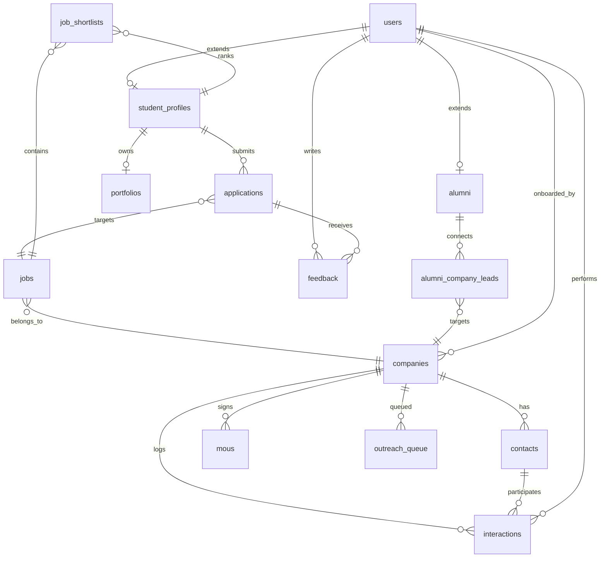

# EduBridge Enterprise — Low-Level Design (LLD) v1.0

> **Owner**: TrailBlazers  
> **Stack**: MySQL 8.0 | Express.js 4.18 | React 18 | Node.js 20  
> **Audience**: Backend & Frontend Development Teams

---

## Table of Contents

1. [Database Schema](#1-database-schema)
2. [API Endpoint Contract](#2-api-endpoint-contract)
3. [Core Logic & Algorithms](#3-core-logic--algorithms)
4. [Security & RBAC](#4-security--rbac)
5. [Frontend–Backend Integration](#5-frontend-backend-integration)

---

## 1. Database Schema

### 1.1 Entity Definitions

#### `users`

Stores every actor in the system (Student, TPO, HOD, Recruiter, Super Admin). A single `role` discriminator drives RBAC.

| Column | Type | Constraints | Description |
|---|---|---|---|
| `id` | `BINARY(16)` | `PK` | UUID v4 |
| `email` | `VARCHAR(255)` | `UNIQUE, NOT NULL` | Login identifier |
| `password_hash` | `CHAR(60)` | `NOT NULL` | bcrypt (cost 12) |
| `role` | `ENUM('super_admin','tpo','hod','student','recruiter')` | `NOT NULL` | RBAC discriminator |
| `full_name` | `VARCHAR(120)` | `NOT NULL` | Display name |
| `phone` | `VARCHAR(20)` | | |
| `avatar_url` | `VARCHAR(512)` | | CDN path |
| `is_active` | `TINYINT(1)` | `NOT NULL, DEFAULT 1` | Soft-delete flag |
| `last_login_at` | `TIMESTAMP` | | |
| `created_at` | `TIMESTAMP` | `NOT NULL, DEFAULT CURRENT_TIMESTAMP` | |
| `updated_at` | `TIMESTAMP` | `NOT NULL, DEFAULT CURRENT_TIMESTAMP ON UPDATE CURRENT_TIMESTAMP` | |

```sql
CREATE TABLE users (
    id BINARY(16) PRIMARY KEY,
    email VARCHAR(255) NOT NULL UNIQUE,
    password_hash CHAR(60) NOT NULL,
    role ENUM('super_admin','tpo','hod','student','recruiter') NOT NULL,
    full_name VARCHAR(120) NOT NULL,
    phone VARCHAR(20),
    avatar_url VARCHAR(512),
    is_active TINYINT(1) NOT NULL DEFAULT 1,
    last_login_at TIMESTAMP NULL,
    created_at TIMESTAMP NOT NULL DEFAULT CURRENT_TIMESTAMP,
    updated_at TIMESTAMP NOT NULL DEFAULT CURRENT_TIMESTAMP ON UPDATE CURRENT_TIMESTAMP,
    INDEX idx_users_role (role),
    INDEX idx_users_email (email)
);
```

#### `student_profiles`

Extends `users` where `role = 'student'`. Holds academic and placement-specific metadata.

| Column | Type | Constraints | Description |
|---|---|---|---|
| `id` | `BINARY(16)` | `PK` | UUID v4 |
| `user_id` | `BINARY(16)` | `FK → users.id, UNIQUE, NOT NULL` | 1:1 with users |
| `enrollment_no` | `VARCHAR(30)` | `UNIQUE, NOT NULL` | College roll number |
| `department` | `VARCHAR(80)` | `NOT NULL` | e.g. Computer Science |
| `batch_year` | `YEAR` | `NOT NULL` | Graduating year |
| `cgpa` | `DECIMAL(3,2)` | | e.g. 8.50 |
| `resume_url` | `VARCHAR(512)` | | CDN path |
| `skills` | `JSON` | | Array of skill strings |
| `project_tags` | `JSON` | | Extracted from portfolio |
| `preferred_roles` | `JSON` | | Array of role strings |
| `is_placed` | `TINYINT(1)` | `DEFAULT 0` | Placement flag |
| `placed_at` | `TIMESTAMP` | | |
| `created_at` | `TIMESTAMP` | `NOT NULL, DEFAULT CURRENT_TIMESTAMP` | |
| `updated_at` | `TIMESTAMP` | `NOT NULL, DEFAULT CURRENT_TIMESTAMP ON UPDATE CURRENT_TIMESTAMP` | |

```sql
CREATE TABLE student_profiles (
    id BINARY(16) PRIMARY KEY,
    user_id BINARY(16) NOT NULL UNIQUE,
    enrollment_no VARCHAR(30) NOT NULL UNIQUE,
    department VARCHAR(80) NOT NULL,
    batch_year YEAR NOT NULL,
    cgpa DECIMAL(3,2),
    resume_url VARCHAR(512),
    skills JSON,
    project_tags JSON,
    preferred_roles JSON,
    is_placed TINYINT(1) DEFAULT 0,
    placed_at TIMESTAMP NULL,
    created_at TIMESTAMP NOT NULL DEFAULT CURRENT_TIMESTAMP,
    updated_at TIMESTAMP NOT NULL DEFAULT CURRENT_TIMESTAMP ON UPDATE CURRENT_TIMESTAMP,
    FOREIGN KEY (user_id) REFERENCES users(id) ON DELETE CASCADE,
    INDEX idx_student_dept (department),
    INDEX idx_student_batch (batch_year)
);
```

#### `companies`

Organizations that interact with the TPO cell.

| Column | Type | Constraints | Description |
|---|---|---|---|
| `id` | `BINARY(16)` | `PK` | UUID v4 |
| `name` | `VARCHAR(180)` | `NOT NULL` | Legal name |
| `website` | `VARCHAR(255)` | | |
| `industry` | `VARCHAR(80)` | | e.g. Fintech, EdTech |
| `size_range` | `ENUM('1-10','11-50','51-200','201-1000','1000+')` | | |
| `headquarters` | `VARCHAR(180)` | | City, Country |
| `description` | `TEXT` | | |
| `logo_url` | `VARCHAR(512)` | | |
| `is_mou_signed` | `TINYINT(1)` | `DEFAULT 0` | |
| `mou_signed_at` | `DATE` | | |
| `mou_expires_at` | `DATE` | | |
| `health_score` | `DECIMAL(5,2)` | `DEFAULT 0.00` | Computed — see §3.2 |
| `status` | `ENUM('lead','active','inactive','blacklisted')` | `NOT NULL, DEFAULT 'lead'` | CRM pipeline stage |
| `created_by` | `BINARY(16)` | `FK → users.id` | TPO who onboarded |
| `created_at` | `TIMESTAMP` | `NOT NULL, DEFAULT CURRENT_TIMESTAMP` | |
| `updated_at` | `TIMESTAMP` | `NOT NULL, DEFAULT CURRENT_TIMESTAMP ON UPDATE CURRENT_TIMESTAMP` | |

```sql
CREATE TABLE companies (
    id BINARY(16) PRIMARY KEY,
    name VARCHAR(180) NOT NULL,
    website VARCHAR(255),
    industry VARCHAR(80),
    size_range ENUM('1-10','11-50','51-200','201-1000','1000+'),
    headquarters VARCHAR(180),
    description TEXT,
    logo_url VARCHAR(512),
    is_mou_signed TINYINT(1) DEFAULT 0,
    mou_signed_at DATE,
    mou_expires_at DATE,
    health_score DECIMAL(5,2) DEFAULT 0.00,
    status ENUM('lead','active','inactive','blacklisted') NOT NULL DEFAULT 'lead',
    created_by BINARY(16),
    created_at TIMESTAMP NOT NULL DEFAULT CURRENT_TIMESTAMP,
    updated_at TIMESTAMP NOT NULL DEFAULT CURRENT_TIMESTAMP ON UPDATE CURRENT_TIMESTAMP,
    FOREIGN KEY (created_by) REFERENCES users(id) ON DELETE SET NULL,
    INDEX idx_company_status (status),
    INDEX idx_company_industry (industry)
);
```

#### `contacts`

Individual people at a company (HR, Hiring Manager, etc.).

| Column | Type | Constraints | Description |
|---|---|---|---|
| `id` | `BINARY(16)` | `PK` | |
| `company_id` | `BINARY(16)` | `FK → companies.id, NOT NULL` | |
| `user_id` | `BINARY(16)` | `FK → users.id, UNIQUE` | Linked recruiter account |
| `full_name` | `VARCHAR(120)` | `NOT NULL` | |
| `designation` | `VARCHAR(100)` | | e.g. "Senior HR Manager" |
| `email` | `VARCHAR(255)` | `NOT NULL` | |
| `phone` | `VARCHAR(20)` | | |
| `is_primary` | `TINYINT(1)` | `DEFAULT 0` | Primary POC |
| `created_at` | `TIMESTAMP` | `NOT NULL, DEFAULT CURRENT_TIMESTAMP` | |
| `updated_at` | `TIMESTAMP` | `NOT NULL, DEFAULT CURRENT_TIMESTAMP ON UPDATE CURRENT_TIMESTAMP` | |

```sql
CREATE TABLE contacts (
    id BINARY(16) PRIMARY KEY,
    company_id BINARY(16) NOT NULL,
    user_id BINARY(16) UNIQUE,
    full_name VARCHAR(120) NOT NULL,
    designation VARCHAR(100),
    email VARCHAR(255) NOT NULL,
    phone VARCHAR(20),
    is_primary TINYINT(1) DEFAULT 0,
    created_at TIMESTAMP NOT NULL DEFAULT CURRENT_TIMESTAMP,
    updated_at TIMESTAMP NOT NULL DEFAULT CURRENT_TIMESTAMP ON UPDATE CURRENT_TIMESTAMP,
    FOREIGN KEY (company_id) REFERENCES companies(id) ON DELETE CASCADE,
    FOREIGN KEY (user_id) REFERENCES users(id) ON DELETE SET NULL,
    INDEX idx_contact_company (company_id)
);
```

#### `jobs`

Placement drives posted by recruiters or TPOs.

| Column | Type | Constraints | Description |
|---|---|---|---|
| `id` | `BINARY(16)` | `PK` | |
| `company_id` | `BINARY(16)` | `FK → companies.id, NOT NULL` | |
| `posted_by` | `BINARY(16)` | `FK → users.id, NOT NULL` | TPO or Recruiter |
| `title` | `VARCHAR(180)` | `NOT NULL` | e.g. "SDE-1 (2025 Batch)" |
| `description` | `TEXT` | `NOT NULL` | Full JD |
| `required_skills` | `JSON` | `NOT NULL` | Tags for matching engine |
| `preferred_skills` | `JSON` | | |
| `min_cgpa` | `DECIMAL(3,2)` | | Eligibility threshold |
| `eligible_depts` | `JSON` | | Array of department strings |
| `batch_year` | `YEAR` | `NOT NULL` | Target batch |
| `location` | `VARCHAR(180)` | | |
| `salary_range` | `VARCHAR(80)` | | e.g. "12-18 LPA" |
| `positions` | `SMALLINT UNSIGNED` | `NOT NULL` | Openings count |
| `status` | `ENUM('draft','open','closed','cancelled')` | `NOT NULL, DEFAULT 'draft'` | |
| `deadline_at` | `TIMESTAMP` | | Application close |
| `drive_date` | `DATE` | | On-campus drive date |
| `created_at` | `TIMESTAMP` | `NOT NULL, DEFAULT CURRENT_TIMESTAMP` | |
| `updated_at` | `TIMESTAMP` | `NOT NULL, DEFAULT CURRENT_TIMESTAMP ON UPDATE CURRENT_TIMESTAMP` | |

```sql
CREATE TABLE jobs (
    id BINARY(16) PRIMARY KEY,
    company_id BINARY(16) NOT NULL,
    posted_by BINARY(16) NOT NULL,
    title VARCHAR(180) NOT NULL,
    description TEXT NOT NULL,
    required_skills JSON NOT NULL,
    preferred_skills JSON,
    min_cgpa DECIMAL(3,2),
    eligible_depts JSON,
    batch_year YEAR NOT NULL,
    location VARCHAR(180),
    salary_range VARCHAR(80),
    positions SMALLINT UNSIGNED NOT NULL,
    status ENUM('draft','open','closed','cancelled') NOT NULL DEFAULT 'draft',
    deadline_at TIMESTAMP NULL,
    drive_date DATE,
    created_at TIMESTAMP NOT NULL DEFAULT CURRENT_TIMESTAMP,
    updated_at TIMESTAMP NOT NULL DEFAULT CURRENT_TIMESTAMP ON UPDATE CURRENT_TIMESTAMP,
    FOREIGN KEY (company_id) REFERENCES companies(id) ON DELETE CASCADE,
    FOREIGN KEY (posted_by) REFERENCES users(id),
    INDEX idx_jobs_status (status),
    INDEX idx_jobs_batch (batch_year),
    INDEX idx_jobs_company (company_id)
);
```

#### `applications`

Each row is a student's application to a job.

| Column | Type | Constraints | Description |
|---|---|---|---|
| `id` | `BINARY(16)` | `PK` | |
| `job_id` | `BINARY(16)` | `FK → jobs.id, NOT NULL` | |
| `student_id` | `BINARY(16)` | `FK → student_profiles.id, NOT NULL` | |
| `match_score` | `DECIMAL(5,2)` | | Computed by Matching Sieve |
| `match_details` | `JSON` | | Breakdown of matched/missed tags |
| `status` | `ENUM('applied','shortlisted','interviewed','offered','accepted','rejected','withdrawn')` | `NOT NULL, DEFAULT 'applied'` | |
| `resume_version` | `VARCHAR(512)` | | Snapshot of resume at submission |
| `submitted_at` | `TIMESTAMP` | `NOT NULL, DEFAULT CURRENT_TIMESTAMP` | |
| `updated_at` | `TIMESTAMP` | `NOT NULL, DEFAULT CURRENT_TIMESTAMP ON UPDATE CURRENT_TIMESTAMP` | |

```sql
CREATE TABLE applications (
    id BINARY(16) PRIMARY KEY,
    job_id BINARY(16) NOT NULL,
    student_id BINARY(16) NOT NULL,
    match_score DECIMAL(5,2),
    match_details JSON,
    status ENUM('applied','shortlisted','interviewed','offered','accepted','rejected','withdrawn') NOT NULL DEFAULT 'applied',
    resume_version VARCHAR(512),
    submitted_at TIMESTAMP NOT NULL DEFAULT CURRENT_TIMESTAMP,
    updated_at TIMESTAMP NOT NULL DEFAULT CURRENT_TIMESTAMP ON UPDATE CURRENT_TIMESTAMP,
    FOREIGN KEY (job_id) REFERENCES jobs(id) ON DELETE CASCADE,
    FOREIGN KEY (student_id) REFERENCES student_profiles(id) ON DELETE CASCADE,
    UNIQUE KEY uq_applications (job_id, student_id),
    INDEX idx_app_status (status),
    INDEX idx_app_student (student_id)
);
```

#### `interactions`

Every touch-point with a company or contact — emails, calls, meetings.

| Column | Type | Constraints | Description |
|---|---|---|---|
| `id` | `BINARY(16)` | `PK` | |
| `company_id` | `BINARY(16)` | `FK → companies.id, NOT NULL` | |
| `contact_id` | `BINARY(16)` | `FK → contacts.id` | |
| `performed_by` | `BINARY(16)` | `FK → users.id, NOT NULL` | TPO who logged it |
| `type` | `ENUM('email','call','meeting','visit','note','other')` | `NOT NULL` | |
| `subject` | `VARCHAR(255)` | | |
| `body` | `TEXT` | | |
| `outcome` | `ENUM('positive','neutral','negative')` | | Sentiment tag |
| `interacted_at` | `TIMESTAMP` | `NOT NULL` | When it happened |
| `created_at` | `TIMESTAMP` | `NOT NULL, DEFAULT CURRENT_TIMESTAMP` | |

```sql
CREATE TABLE interactions (
    id BINARY(16) PRIMARY KEY,
    company_id BINARY(16) NOT NULL,
    contact_id BINARY(16),
    performed_by BINARY(16) NOT NULL,
    type ENUM('email','call','meeting','visit','note','other') NOT NULL,
    subject VARCHAR(255),
    body TEXT,
    outcome ENUM('positive','neutral','negative'),
    interacted_at TIMESTAMP NOT NULL,
    created_at TIMESTAMP NOT NULL DEFAULT CURRENT_TIMESTAMP,
    FOREIGN KEY (company_id) REFERENCES companies(id) ON DELETE CASCADE,
    FOREIGN KEY (contact_id) REFERENCES contacts(id) ON DELETE SET NULL,
    FOREIGN KEY (performed_by) REFERENCES users(id),
    INDEX idx_interact_company (company_id),
    INDEX idx_interact_date (interacted_at)
);
```

#### `mous`

Digital Memorandum of Understanding records.

| Column | Type | Constraints | Description |
|---|---|---|---|
| `id` | `BINARY(16)` | `PK` | |
| `company_id` | `BINARY(16)` | `FK → companies.id, NOT NULL` | |
| `signed_by_contact` | `BINARY(16)` | `FK → contacts.id` | Company signatory |
| `signed_by_tpo` | `BINARY(16)` | `FK → users.id, NOT NULL` | TPO signatory |
| `document_url` | `VARCHAR(512)` | `NOT NULL` | Signed PDF |
| `signed_at` | `DATE` | `NOT NULL` | |
| `expires_at` | `DATE` | `NOT NULL` | |
| `terms_summary` | `JSON` | | e.g. {"min_offers":5,"exclusivity":false} |
| `status` | `ENUM('active','expired','terminated')` | `NOT NULL, DEFAULT 'active'` | |
| `created_at` | `TIMESTAMP` | `NOT NULL, DEFAULT CURRENT_TIMESTAMP` | |
| `updated_at` | `TIMESTAMP` | `NOT NULL, DEFAULT CURRENT_TIMESTAMP ON UPDATE CURRENT_TIMESTAMP` | |

```sql
CREATE TABLE mous (
    id BINARY(16) PRIMARY KEY,
    company_id BINARY(16) NOT NULL,
    signed_by_contact BINARY(16),
    signed_by_tpo BINARY(16) NOT NULL,
    document_url VARCHAR(512) NOT NULL,
    signed_at DATE NOT NULL,
    expires_at DATE NOT NULL,
    terms_summary JSON,
    status ENUM('active','expired','terminated') NOT NULL DEFAULT 'active',
    created_at TIMESTAMP NOT NULL DEFAULT CURRENT_TIMESTAMP,
    updated_at TIMESTAMP NOT NULL DEFAULT CURRENT_TIMESTAMP ON UPDATE CURRENT_TIMESTAMP,
    FOREIGN KEY (company_id) REFERENCES companies(id) ON DELETE CASCADE,
    FOREIGN KEY (signed_by_contact) REFERENCES contacts(id) ON DELETE SET NULL,
    FOREIGN KEY (signed_by_tpo) REFERENCES users(id),
    INDEX idx_mou_company (company_id),
    INDEX idx_mou_status (status)
);
```

#### `alumni`

| Column | Type | Constraints | Description |
|---|---|---|---|
| `id` | `BINARY(16)` | `PK` | |
| `user_id` | `BINARY(16)` | `FK → users.id, UNIQUE, NOT NULL` | Links to their student user |
| `student_profile_id` | `BINARY(16)` | `FK → student_profiles.id, UNIQUE, NOT NULL` | |
| `current_company` | `VARCHAR(180)` | | Employer name |
| `current_designation` | `VARCHAR(100)` | | |
| `current_location` | `VARCHAR(180)` | | |
| `linkedin_url` | `VARCHAR(512)` | | |
| `is_visible` | `TINYINT(1)` | `DEFAULT 1` | Opt-in for directory |
| `is_verified` | `TINYINT(1)` | `DEFAULT 0` | TPO-verified |
| `created_at` | `TIMESTAMP` | `NOT NULL, DEFAULT CURRENT_TIMESTAMP` | |
| `updated_at` | `TIMESTAMP` | `NOT NULL, DEFAULT CURRENT_TIMESTAMP ON UPDATE CURRENT_TIMESTAMP` | |

```sql
CREATE TABLE alumni (
    id BINARY(16) PRIMARY KEY,
    user_id BINARY(16) NOT NULL UNIQUE,
    student_profile_id BINARY(16) NOT NULL UNIQUE,
    current_company VARCHAR(180),
    current_designation VARCHAR(100),
    current_location VARCHAR(180),
    linkedin_url VARCHAR(512),
    is_visible TINYINT(1) DEFAULT 1,
    is_verified TINYINT(1) DEFAULT 0,
    created_at TIMESTAMP NOT NULL DEFAULT CURRENT_TIMESTAMP,
    updated_at TIMESTAMP NOT NULL DEFAULT CURRENT_TIMESTAMP ON UPDATE CURRENT_TIMESTAMP,
    FOREIGN KEY (user_id) REFERENCES users(id) ON DELETE CASCADE,
    FOREIGN KEY (student_profile_id) REFERENCES student_profiles(id) ON DELETE CASCADE
);
```

#### `portfolios`

Student portfolio snapshots used by the Matching Sieve.

| Column | Type | Constraints | Description |
|---|---|---|---|
| `id` | `BINARY(16)` | `PK` | |
| `student_id` | `BINARY(16)` | `FK → student_profiles.id, NOT NULL` | |
| `title` | `VARCHAR(180)` | | Project / portfolio title |
| `description` | `TEXT` | | |
| `tags` | `JSON` | | Auto-extracted keywords |
| `url` | `VARCHAR(512)` | | GitHub / live link |
| `type` | `ENUM('project','certification','publication','other')` | `DEFAULT 'project'` | |
| `is_active` | `TINYINT(1)` | `DEFAULT 1` | |
| `created_at` | `TIMESTAMP` | `NOT NULL, DEFAULT CURRENT_TIMESTAMP` | |
| `updated_at` | `TIMESTAMP` | `NOT NULL, DEFAULT CURRENT_TIMESTAMP ON UPDATE CURRENT_TIMESTAMP` | |

```sql
CREATE TABLE portfolios (
    id BINARY(16) PRIMARY KEY,
    student_id BINARY(16) NOT NULL,
    title VARCHAR(180),
    description TEXT,
    tags JSON,
    url VARCHAR(512),
    type ENUM('project','certification','publication','other') DEFAULT 'project',
    is_active TINYINT(1) DEFAULT 1,
    created_at TIMESTAMP NOT NULL DEFAULT CURRENT_TIMESTAMP,
    updated_at TIMESTAMP NOT NULL DEFAULT CURRENT_TIMESTAMP ON UPDATE CURRENT_TIMESTAMP,
    FOREIGN KEY (student_id) REFERENCES student_profiles(id) ON DELETE CASCADE,
    INDEX idx_portfolio_student (student_id)
);
```

#### `feedback`

Recruiter feedback on candidates and the hiring process.

| Column | Type | Constraints | Description |
|---|---|---|---|
| `id` | `BINARY(16)` | `PK` | |
| `application_id` | `BINARY(16)` | `FK → applications.id, NOT NULL` | |
| `recruiter_id` | `BINARY(16)` | `FK → users.id, NOT NULL` | |
| `round` | `VARCHAR(60)` | | e.g. "Technical Round 1" |
| `rating` | `TINYINT UNSIGNED` | `CHECK (1-5)` | |
| `comments` | `TEXT` | | |
| `created_at` | `TIMESTAMP` | `NOT NULL, DEFAULT CURRENT_TIMESTAMP` | |

```sql
CREATE TABLE feedback (
    id BINARY(16) PRIMARY KEY,
    application_id BINARY(16) NOT NULL,
    recruiter_id BINARY(16) NOT NULL,
    round VARCHAR(60),
    rating TINYINT UNSIGNED CHECK (rating BETWEEN 1 AND 5),
    comments TEXT,
    created_at TIMESTAMP NOT NULL DEFAULT CURRENT_TIMESTAMP,
    FOREIGN KEY (application_id) REFERENCES applications(id) ON DELETE CASCADE,
    FOREIGN KEY (recruiter_id) REFERENCES users(id),
    INDEX idx_feedback_app (application_id)
);
```

#### `outreach_queue`

Holds pending email tasks consumed by the async worker.

| Column | Type | Constraints | Description |
|---|---|---|---|
| `id` | `BINARY(16)` | `PK` | |
| `company_id` | `BINARY(16)` | `FK → companies.id` | |
| `template_id` | `VARCHAR(80)` | | e.g. "welcome_lead" |
| `recipients` | `JSON` | `NOT NULL` | Array of emails / contact IDs |
| `subject` | `VARCHAR(255)` | `NOT NULL` | |
| `body_html` | `TEXT` | `NOT NULL` | Rendered HTML |
| `status` | `ENUM('pending','processing','sent','failed')` | `NOT NULL, DEFAULT 'pending'` | |
| `error_log` | `TEXT` | | |
| `scheduled_at` | `TIMESTAMP` | | |
| `processed_at` | `TIMESTAMP` | | |
| `created_at` | `TIMESTAMP` | `NOT NULL, DEFAULT CURRENT_TIMESTAMP` | |

```sql
CREATE TABLE outreach_queue (
    id BINARY(16) PRIMARY KEY,
    company_id BINARY(16),
    template_id VARCHAR(80),
    recipients JSON NOT NULL,
    subject VARCHAR(255) NOT NULL,
    body_html TEXT NOT NULL,
    status ENUM('pending','processing','sent','failed') NOT NULL DEFAULT 'pending',
    error_log TEXT,
    scheduled_at TIMESTAMP NULL,
    processed_at TIMESTAMP NULL,
    created_at TIMESTAMP NOT NULL DEFAULT CURRENT_TIMESTAMP,
    FOREIGN KEY (company_id) REFERENCES companies(id) ON DELETE SET NULL,
    INDEX idx_outreach_status (status),
    INDEX idx_outreach_scheduled (scheduled_at)
);
```

### 1.2 Junction Tables (N:N)

#### `job_shortlists`

TPO adds/reorders shortlisted students per job.

| Column | Type | Constraints | Description |
|---|---|---|---|
| `job_id` | `BINARY(16)` | `FK → jobs.id, NOT NULL` | |
| `student_id` | `BINARY(16)` | `FK → student_profiles.id, NOT NULL` | |
| `rank` | `SMALLINT UNSIGNED` | | TPO-assigned rank |
| `added_by` | `BINARY(16)` | `FK → users.id` | |
| `created_at` | `TIMESTAMP` | `NOT NULL, DEFAULT CURRENT_TIMESTAMP` | |

```sql
CREATE TABLE job_shortlists (
    job_id BINARY(16) NOT NULL,
    student_id BINARY(16) NOT NULL,
    rank SMALLINT UNSIGNED,
    added_by BINARY(16),
    created_at TIMESTAMP NOT NULL DEFAULT CURRENT_TIMESTAMP,
    PRIMARY KEY (job_id, student_id),
    FOREIGN KEY (job_id) REFERENCES jobs(id) ON DELETE CASCADE,
    FOREIGN KEY (student_id) REFERENCES student_profiles(id) ON DELETE CASCADE,
    FOREIGN KEY (added_by) REFERENCES users(id) ON DELETE SET NULL
);
```

#### `alumni_company_leads`

Maps alumni to companies they can introduce.

| Column | Type | Constraints | Description |
|---|---|---|---|
| `alumni_id` | `BINARY(16)` | `FK → alumni.id, NOT NULL` | |
| `company_id` | `BINARY(16)` | `FK → companies.id, NOT NULL` | |
| `relationship` | `ENUM('works_at','former_employee','board_member','referred')` | `NOT NULL` | |
| `notes` | `TEXT` | | |
| `created_at` | `TIMESTAMP` | `NOT NULL, DEFAULT CURRENT_TIMESTAMP` | |

```sql
CREATE TABLE alumni_company_leads (
    alumni_id BINARY(16) NOT NULL,
    company_id BINARY(16) NOT NULL,
    relationship ENUM('works_at','former_employee','board_member','referred') NOT NULL,
    notes TEXT,
    created_at TIMESTAMP NOT NULL DEFAULT CURRENT_TIMESTAMP,
    PRIMARY KEY (alumni_id, company_id),
    FOREIGN KEY (alumni_id) REFERENCES alumni(id) ON DELETE CASCADE,
    FOREIGN KEY (company_id) REFERENCES companies(id) ON DELETE CASCADE
);
```

### 1.3 Entity Relationship Diagram (ERD)



---

## 2. API Endpoint Contract

### 2.1 Standardised Response Envelope

Every endpoint returns:

```json
{
    "success": true,
    "data": { ... },
    "meta": {
        "page": 1,
        "per_page": 20,
        "total": 142
    },
    "error": null
}
```

On failure:

```json
{
    "success": false,
    "data": null,
    "meta": null,
    "error": {
        "code": "COMPANY_NOT_FOUND",
        "message": "No company exists with the given ID.",
        "details": { "company_id": "abc-123" }
    }
}
```

HTTP status codes: `200` (success), `201` (created), `400` (validation), `401` (unauthenticated), `403` (forbidden), `404` (not found), `409` (conflict), `422` (unprocessable), `429` (rate-limited), `500` (internal).

### 2.2 Module: Authentication

| Method | Endpoint | Request Body | Success Response | Errors |
|---|---|---|---|---|
| `POST` | `/api/auth/login` | `{ "email", "password" }` | `201` → `{ "access_token", "refresh_token", "user" }` | `400` validation, `401` invalid credentials |
| `POST` | `/api/auth/register` | `{ "email", "password", "full_name", "role" }` | `201` → `{ "user" }` | `400` validation, `409` email exists |
| `POST` | `/api/auth/refresh` | `{ "refresh_token" }` | `200` → `{ "access_token", "refresh_token" }` | `401` invalid/expired refresh |
| `POST` | `/api/auth/logout` | — | `200` → `{ "message" }` | `401` |
| `POST` | `/api/auth/forgot-password` | `{ "email" }` | `200` → `{ "message" }` | `404` email not found |
| `POST` | `/api/auth/reset-password` | `{ "token", "password" }` | `200` → `{ "message" }` | `400` invalid/expired token |

### 2.3 Module: Users

| Method | Endpoint | Request Body | Success Response | Errors |
|---|---|---|---|---|
| `GET` | `/api/users/me` | — | `200` → `{ "user" }` | `401` |
| `PUT` | `/api/users/me` | `{ "full_name", "phone", "avatar_url" }` | `200` → `{ "user" }` | `400`, `401` |
| `GET` | `/api/users` | Query: `?role=tpo&page=1&per_page=20` | `200` → `{ "users": [...], "meta" }` | `401`, `403` |
| `GET` | `/api/users/:id` | — | `200` → `{ "user" }` | `401`, `403`, `404` |
| `PUT` | `/api/users/:id/status` | `{ "is_active": false }` | `200` → `{ "user" }` | `401`, `403`, `404` |

### 2.4 Module: Companies

| Method | Endpoint | Request Body | Success Response | Errors |
|---|---|---|---|---|
| `POST` | `/api/companies` | `{ "name", "website", "industry", "description" }` | `201` → `{ "company" }` | `400`, `401` |
| `GET` | `/api/companies` | Query: `?status=active&industry=Fintech&page=1` | `200` → `{ "companies": [...], "meta" }` | `401` |
| `GET` | `/api/companies/:id` | — | `200` → `{ "company" }` | `401`, `404` |
| `PUT` | `/api/companies/:id` | `{ "name", "status", "industry" }` | `200` → `{ "company" }` | `400`, `401`, `403`, `404` |
| `DELETE` | `/api/companies/:id` | — | `200` → `{ "message" }` | `401`, `403`, `404` |
| `GET` | `/api/companies/:id/health` | — | `200` → `{ "health_score", "breakdown" }` | `401`, `404` |

### 2.5 Module: Contacts

| Method | Endpoint | Request Body | Success Response | Errors |
|---|---|---|---|---|
| `POST` | `/api/companies/:companyId/contacts` | `{ "full_name", "email", "designation", "is_primary" }` | `201` → `{ "contact" }` | `400`, `401`, `404` |
| `GET` | `/api/companies/:companyId/contacts` | — | `200` → `{ "contacts": [...] }` | `401`, `404` |
| `PUT` | `/api/companies/:companyId/contacts/:id` | `{ "full_name", "designation" }` | `200` → `{ "contact" }` | `400`, `401`, `403`, `404` |
| `DELETE` | `/api/companies/:companyId/contacts/:id` | — | `200` → `{ "message" }` | `401`, `403`, `404` |

### 2.6 Module: Jobs

| Method | Endpoint | Request Body | Success Response | Errors |
|---|---|---|---|---|
| `POST` | `/api/jobs` | `{ "company_id", "title", "description", "required_skills", "min_cgpa", "eligible_depts", "batch_year", "positions", "deadline_at", "drive_date" }` | `201` → `{ "job" }` | `400`, `401`, `403` |
| `GET` | `/api/jobs` | Query: `?status=open&batch_year=2025&company_id=x` | `200` → `{ "jobs": [...], "meta" }` | `401` |
| `GET` | `/api/jobs/:id` | — | `200` → `{ "job" }` | `401`, `404` |
| `PUT` | `/api/jobs/:id` | `{ "title", "status", "positions" }` | `200` → `{ "job" }` | `400`, `401`, `403`, `404` |
| `DELETE` | `/api/jobs/:id` | — | `200` → `{ "message" }` | `401`, `403`, `404` |
| `POST` | `/api/jobs/:id/publish` | — | `200` → `{ "job" }` | `401`, `403`, `404` |
| `POST` | `/api/jobs/:id/close` | — | `200` → `{ "job" }` | `401`, `403`, `404` |

### 2.7 Module: Applications

| Method | Endpoint | Request Body | Success Response | Errors |
|---|---|---|---|---|
| `POST` | `/api/jobs/:jobId/apply` | — | `201` → `{ "application", "match_score" }` | `400` (duplicate), `401`, `403`, `404` |
| `GET` | `/api/jobs/:jobId/applications` | Query: `?status=shortlisted&sort=match_score` | `200` → `{ "applications": [...], "meta" }` | `401`, `403`, `404` |
| `GET` | `/api/applications/:id` | — | `200` → `{ "application" }` | `401`, `404` |
| `PUT` | `/api/applications/:id/status` | `{ "status": "shortlisted" }` | `200` → `{ "application" }` | `400`, `401`, `403`, `404` |
| `GET` | `/api/students/me/applications` | — | `200` → `{ "applications": [...], "meta" }` | `401` |

### 2.8 Module: Matching (MLS — Matching Logic Service)

| Method | Endpoint | Request Body | Success Response | Errors |
|---|---|---|---|---|
| `POST` | `/api/matching/score/:studentId/:jobId` | — | `200` → `{ "match_score", "breakdown" }` | `401`, `404` |
| `POST` | `/api/matching/batch/:jobId` | — | `202` → `{ "message", "queue_id" }` | `401`, `403`, `404` |
| `GET` | `/api/matching/shortlist/:jobId` | Query: `?min_score=70&limit=30` | `200` → `{ "shortlist": [...], "meta" }` | `401`, `403`, `404` |

### 2.9 Module: Interactions

| Method | Endpoint | Request Body | Success Response | Errors |
|---|---|---|---|---|
| `POST` | `/api/companies/:companyId/interactions` | `{ "type", "subject", "body", "outcome", "contact_id", "interacted_at" }` | `201` → `{ "interaction" }` | `400`, `401`, `404` |
| `GET` | `/api/companies/:companyId/interactions` | Query: `?type=meeting&from=2025-01-01` | `200` → `{ "interactions": [...], "meta" }` | `401`, `404` |

### 2.10 Module: MoUs

| Method | Endpoint | Request Body | Success Response | Errors |
|---|---|---|---|---|
| `POST` | `/api/companies/:companyId/mous` | `{ "document_url", "signed_at", "expires_at", "terms_summary", "signed_by_contact" }` | `201` → `{ "mou" }` | `400`, `401`, `403`, `404` |
| `GET` | `/api/companies/:companyId/mous` | — | `200` → `{ "mous": [...] }` | `401`, `404` |
| `PUT` | `/api/companies/:companyId/mous/:id` | `{ "status": "terminated" }` | `200` → `{ "mou" }` | `400`, `401`, `403`, `404` |

### 2.11 Module: Alumni

| Method | Endpoint | Request Body | Success Response | Errors |
|---|---|---|---|---|
| `POST` | `/api/alumni` | `{ "user_id", "current_company", "current_designation" }` | `201` → `{ "alumni" }` | `400`, `401`, `403`, `409` |
| `GET` | `/api/alumni` | Query: `?current_company=x&is_verified=1&page=1` | `200` → `{ "alumni": [...], "meta" }` | `401` |
| `GET` | `/api/alumni/:id` | — | `200` → `{ "alumni" }` | `401`, `404` |
| `PUT` | `/api/alumni/:id` | `{ "current_company", "current_designation", "is_visible" }` | `200` → `{ "alumni" }` | `400`, `401`, `403`, `404` |

### 2.12 Module: Portfolios

| Method | Endpoint | Request Body | Success Response | Errors |
|---|---|---|---|---|
| `POST` | `/api/portfolios` | `{ "title", "description", "tags", "url", "type" }` | `201` → `{ "portfolio" }` | `400`, `401` |
| `GET` | `/api/students/:studentId/portfolios` | — | `200` → `{ "portfolios": [...] }` | `401`, `404` |
| `PUT` | `/api/portfolios/:id` | `{ "title", "tags", "is_active" }` | `200` → `{ "portfolio" }` | `400`, `401`, `403`, `404` |
| `DELETE` | `/api/portfolios/:id` | — | `200` → `{ "message" }` | `401`, `403`, `404` |

### 2.13 Module: Outreach

| Method | Endpoint | Request Body | Success Response | Errors |
|---|---|---|---|---|
| `POST` | `/api/outreach/send` | `{ "company_id", "template_id", "recipients", "subject", "body_html", "scheduled_at" }` | `202` → `{ "queue_id" }` | `400`, `401`, `403` |
| `GET` | `/api/outreach/queue` | Query: `?status=pending` | `200` → `{ "queue": [...], "meta" }` | `401`, `403` |
| `POST` | `/api/outreach/queue/:id/cancel` | — | `200` → `{ "message" }` | `401`, `403`, `404` |

### 2.14 Module: Health Score (on-demand)

| Method | Endpoint | Request Body | Success Response | Errors |
|---|---|---|---|---|
| `POST` | `/api/health/recalculate/:companyId` | — | `202` → `{ "message" }` | `401`, `403`, `404` |
| `GET` | `/api/health/breakdown/:companyId` | — | `200` → `{ "score", "components" }` | `401`, `404` |

### 2.15 Module: Feedback

| Method | Endpoint | Request Body | Success Response | Errors |
|---|---|---|---|---|
| `POST` | `/api/applications/:applicationId/feedback` | `{ "recruiter_id", "round", "rating", "comments" }` | `201` → `{ "feedback" }` | `400`, `401`, `403`, `404` |
| `GET` | `/api/applications/:applicationId/feedback` | — | `200` → `{ "feedback_list": [...] }` | `401`, `404` |

---

## 3. Core Logic & Algorithms

### 3.1 The Matching Sieve (Rule-Based Matching Engine)

The engine compares a job's required/preferred skill tags against a student's `skills`, `project_tags`, and `preferred_roles`. It produces a weighted score from 0.00–100.00.

```
FUNCTION compute_match_score(student, job):
    required   = job.required_skills    // JSON array of strings
    preferred  = job.preferred_skills   // JSON array of strings
    student_skills = student.skills     // JSON array
    project_tags   = student.project_tags
    roles          = student.preferred_roles

    // ── Weight configuration ──
    W_REQUIRED = 50    // max points for covering all required skills
    W_PREFERRED = 20   // max points for preferred skills
    W_PROJECT = 15     // project tag overlap
    W_ROLE = 10        // role alignment
    W_CGPA = 5         // CGPA threshold bonus

    // ── 1. Required Skills Match ──
    required_normalised = NORMALISE_TAGS(required)
    student_normalised  = NORMALISE_TAGS(student_skills ∪ project_tags)

    required_hit = COUNT_MATCHES(required_normalised, student_normalised)
    required_score = (required_hit / LEN(required_normalised)) × W_REQUIRED

    // ── 2. Preferred Skills Bonus ──
    preferred_hit = COUNT_MATCHES(NORMALISE_TAGS(preferred), student_normalised)
    preferred_score = (preferred_hit / MAX(LEN(preferred), 1)) × W_PREFERRED

    // ── 3. Project Tag Overlap ──
    project_hit = COUNT_MATCHES(NORMALISE_TAGS(project_tags), NORMALISE_TAGS(required))
    project_score = (project_hit / MAX(LEN(required), 1)) × W_PROJECT

    // ── 4. Role Alignment ──
    role_match_found = FALSE
    FOR EACH role IN roles:
        IF CONTAINS(job.title, role) OR CONTAINS(job.description, role):
            role_match_found = TRUE
            BREAK
    role_score = role_match_found ? W_ROLE : 0

    // ── 5. CGPA Threshold ──
    cgpa_score = 0
    IF job.min_cgpa IS NOT NULL AND student.cgpa IS NOT NULL:
        IF student.cgpa >= job.min_cgpa:
            cgpa_score = W_CGPA
        ELSE:
            cgpa_score = (student.cgpa / job.min_cgpa) × W_CGPA × 0.5  // partial penalty

    // ── Final Score ──
    total = required_score + preferred_score + project_score + role_score + cgpa_score
    total = CLAMP(total, 0.00, 100.00)

    breakdown = {
        "required": ROUND(required_score, 2),
        "preferred": ROUND(preferred_score, 2),
        "project_overlap": ROUND(project_score, 2),
        "role_alignment": ROUND(role_score, 2),
        "cgpa": ROUND(cgpa_score, 2),
        "total": ROUND(total, 2)
    }

    RETURN breakdown
END_FUNCTION

// Helper: NORMALISE_TAGS converts all tags to lowercase, trims whitespace,
// and removes duplicates.
FUNCTION NORMALISE_TAGS(tags):
    normalised = NEW SET
    FOR EACH tag IN tags:
        normalised.add(TRIM(LOWERCASE(tag)))
    RETURN normalised
END_FUNCTION

// Helper: COUNT_MATCHES returns size of set intersection.
FUNCTION COUNT_MATCHES(set_a, set_b):
    RETURN SIZE(set_a ∩ set_b)
END_FUNCTION
```

**Batch processing:** `POST /api/matching/batch/:jobId` enqueues a BullMQ job. The worker processes students in chunks of 50, writing `match_score` and `match_details` to the `applications` table. This keeps the API responsive for jobs with 500+ applicants.

### 3.2 Health Score Calculation

The `CompanyHealthScore` is a weighted composite metric computed from three dimensions.

```
DIMENSION 1 — Engagement (40 pts)
   Indicators:
     - interaction_count: number of interactions in last 12 months
     - interaction_recency: days since last interaction
     - interaction_variety: distinct interaction types used

   score_engagement = MIN((
         (interaction_count / 12) × 15
       + (MAX(0, 365 - interaction_recency) / 365) × 15
       + (interaction_variety / 4) × 10
   ), 40)

DIMENSION 2 — Placement History (35 pts)
   Indicators:
     - placement_ratio: offers_accepted / positions_offered (last 3 years)
     - consistency: number of consecutive years the company recruited
     - avg_offer_quality: average CTC relative to batch median

   score_placement = MIN((
         placement_ratio × 15
       + (consistency / 3) × 10
       + MIN(avg_offer_quality / batch_median_ctc, 2) × 10
   ), 35)

DIMENSION 3 — MoU & Partnership (25 pts)
   Indicators:
     - mou_status: active → 10, expired → 5, none → 0
     - mou_tenure_remaining: months until expiry (capped at 24)
     - terms_fulfilled: percentage of MoU commitments met

   score_mou = MIN((
         mou_status_score
       + (mou_tenure_remaining / 24) × 8
       + terms_fulfilled × 7
   ), 25)

FINAL: health_score = score_engagement + score_placement + score_mou
RANGE: 0.00 – 100.00
```

**Recalculation triggers:**
- On every new interaction (async — debounced by 5 minutes via Redis).
- On every application status change to `accepted`.
- On MoU create/update/expire.
- Scheduled cron: runs nightly at 02:00 for all companies with `status = 'active'`.

### 3.3 Outreach Queue (Bulk Email System)

The outreach engine must never block the HTTP request thread. Architecture:

```
┌─────────────┐     ┌──────────────┐     ┌────────────┐     ┌──────────┐
│  Client      │ ──> │  Express      │ ──> │  BullMQ     │ ──> │  Worker  │
│  POST /send  │     │  (validate    │     │  (Redis)    │     │  (batch) │
│              │     │   + enqueue)  │     │             │     │          │
└─────────────┘     └──────────────┘     └────────────┘     └──────────┘
                                                                    │
                                                           ┌────────┴────────┐
                                                           │  Nodemailer     │
                                                           │  (SMTP pool)    │
                                                           └─────────────────┘
```

**Pseudocode:**

```
FUNCTION handle_outreach_send(req, res):
    VALIDATE req.body (schema: company_id, template_id, recipients, subject, body_html)
    INSERT INTO outreach_queue (company_id, template_id, recipients, subject, body_html, status='pending')
    ENQUEUE BullMQ job with:
        name: 'send_email'
        data: { queue_row_id }
        opts: { attempts: 3, backoff: { type: 'exponential', delay: 5000 } }
    RETURN 202 { queue_id: new_row.id }
END_FUNCTION

// Worker (runs in separate process)
FUNCTION process_email_job(job):
    row = SELECT * FROM outreach_queue WHERE id = job.data.queue_row_id
    IF row.status IN ('sent', 'cancelled'):
        RETURN  // idempotency guard

    UPDATE outreach_queue SET status = 'processing' WHERE id = row.id

    transporter = NODEMAILER_CREATE_POOL({
        pool: true,
        maxConnections: 5,
        rateLimit: 30  // max 30 emails per second
    })

    batch = PARSE_JSON(row.recipients)  // array of email strings
    failed = []

    FOR EACH email IN batch:
        TRY:
            await transporter.sendMail({
                from: 'noreply@edubridge.edu',
                to: email,
                subject: row.subject,
                html: row.body_html
            })
        CATCH err:
            failed.push({ email, error: err.message })

        DELAY(33ms)  // ~30 emails/sec throttle

    status = failed.length === batch.length ? 'failed' : 'sent'
    error_log = failed.length > 0 ? JSON.stringify(failed) : NULL

    UPDATE outreach_queue
    SET status = status, error_log = error_log, processed_at = NOW()
    WHERE id = row.id
END_FUNCTION
```

**Key guarantees:**
- **Pooled SMTP** with `maxConnections: 5` prevents socket starvation.
- **Rate limit** of 30 emails/second per worker stays under SMTP provider quotas (SendGrid 100/s, SES 50/s).
- **Backoff & retry** with 3 attempts; dead-letter after final failure.
- **Idempotency** via status check before processing.

---

## 4. Security & RBAC Implementation

### 4.1 JWT Middleware Flow

```
┌──────────┐       ┌──────────────┐       ┌────────────┐
│  Client   │       │  Middleware   │       │  Controller │
│  (Bearer  │       │  authenticate │       │             │
│   token)  │       │              │       │             │
└────┬─────┘       └──────┬───────┘       └──────┬──────┘
     │  Authorization:    │                       │
     │  Bearer <token>    │                       │
     │──────────────────>│                       │
     │                   │                        │
     │                   │ 1. Extract token from  │
     │                   │    header              │
     │                   │ 2. Verify with         │
     │                   │    jwt.verify(token,   │
     │                   │    ACCESS_SECRET)      │
     │                   │                        │
     │                   │ 3. Decode payload:     │
     │                   │    { sub: user_id,     │
     │                   │      role: 'tpo',      │
     │                   │      iat, exp }        │
     │                   │                        │
     │                   │ 4. Load user from DB:  │
     │                   │    SELECT id, role,    │
     │                   │    is_active FROM users │
     │                   │    WHERE id = sub      │
     │                   │                        │
     │                   │ 5. If !is_active →     │
     │                   │    throw 401           │
     │                   │                        │
     │                   │ 6. Attach req.user = { │
     │                   │      id, role, email   │
     │                   │    }                   │
     │                   │                        │
     │                   │ 7. Call next()         │
     │                   │ ──────────────────────>│
     │                   │                        │
     │                 [ROLE GATE]                │
     │                   │                        │
     │                   │ requireRole('tpo',     │
     │                   │   'super_admin')       │
     │                   │ ──────────────────────>│
     │                   │                        │
     │                   │   8. If role not in    │
     │                   │      allowed → 403     │
     │                   │                        │
     │                   │ 9. Controller executes │
     │                   │    business logic      │
```

**Access Token:** 15-minute expiry, signed with `ACCESS_TOKEN_SECRET`.  
**Refresh Token:** 7-day expiry, signed with `REFRESH_TOKEN_SECRET`, stored as HTTP-only cookie (`SameSite=Strict`, `Secure` in production). Rotation: old refresh token is invalidated on each refresh.

### 4.2 Permission Matrix

| Operation | Super Admin | TPO | HOD | Student | Recruiter |
|---|---|---|---|---|---|
| **Users** | | | | | |
| List all users | ✓ | ✓ (TPOs, Students) | ✗ | ✗ | ✗ |
| View own profile | ✓ | ✓ | ✓ | ✓ | ✓ |
| Deactivate user | ✓ | ✗ | ✗ | ✗ | ✗ |
| **Companies** | | | | | |
| Create company | ✓ | ✓ | ✗ | ✗ | ✗ |
| View company | ✓ | ✓ | ✓ | ✓ | ✓ (own) |
| Edit company | ✓ | ✓ | ✗ | ✗ | ✗ |
| Delete company | ✓ | ✗ | ✗ | ✗ | ✗ |
| View health score | ✓ | ✓ | ✓ | ✗ | ✗ |
| **Jobs** | | | | | |
| Create job | ✓ | ✓ (publish) | ✗ | ✗ | ✓ (draft) |
| View job | ✓ | ✓ | ✓ | ✓ | ✓ |
| Edit job | ✓ | ✓ (own) | ✗ | ✗ | ✓ (own draft) |
| Delete job | ✓ | ✓ (own) | ✗ | ✗ | ✗ |
| Close/publish job | ✓ | ✓ | ✗ | ✗ | ✗ |
| **Applications** | | | | | |
| View all applications | ✓ | ✓ | ✓ (stats) | ✓ (own) | ✓ (own job) |
| Update status | ✓ | ✓ | ✗ | ✗ | ✓ (shortlist) |
| **MoUs** | | | | | |
| Create MoU | ✓ | ✓ | ✗ | ✗ | ✗ |
| View MoU | ✓ | ✓ | ✓ | ✗ | ✓ (own) |
| Terminate MoU | ✓ | ✗ | ✗ | ✗ | ✗ |
| **Interactions** | | | | | |
| Log interaction | ✓ | ✓ | ✗ | ✗ | ✗ |
| View interactions | ✓ | ✓ | ✓ | ✗ | ✗ |
| **Alumni** | | | | | |
| Create alumni record | ✓ | ✓ | ✗ | ✗ | ✗ |
| View alumni | ✓ | ✓ | ✓ | ✓ | ✗ |
| Verify alumni | ✓ | ✓ | ✗ | ✗ | ✗ |
| **Outreach** | | | | | |
| Send outreach | ✓ | ✓ | ✗ | ✗ | ✗ |
| View queue | ✓ | ✓ | ✗ | ✗ | ✗ |
| **Portfolios** | | | | | |
| Create/edit own | ✓ | ✗ | ✗ | ✓ | ✗ |
| View any | ✓ | ✓ | ✓ | ✓ | ✓ |
| **Feedback** | | | | | |
| Submit feedback | ✓ | ✗ | ✗ | ✗ | ✓ |
| View feedback | ✓ | ✓ | ✓ | ✓ (own) | ✓ (own) |
| **System** | | | | | |
| View logs/analytics | ✓ | ✓ (placement) | ✓ (academic) | ✗ | ✗ |

### 4.3 Password Hashing & Session Expiry

```
// Registration
password_hash = BCrypt.hashSync(plain_password, 12)
// cost=12 → ~250ms per hash (hardens against brute-force)

// Login
is_valid = BCrypt.compareSync(plain_password, stored_hash)
IF !is_valid → 401

// Session
access_token = JWT.sign(
    { sub: user.id, role: user.role },
    ACCESS_TOKEN_SECRET,
    { expiresIn: '15m' }
)

refresh_token = JWT.sign(
    { sub: user.id, token_version: user.token_version },
    REFRESH_TOKEN_SECRET,
    { expiresIn: '7d' }
)

// On logout: increment user.token_version (invalidates all refresh tokens)
// On password change: increment user.token_version
// On suspicious activity: super_admin can force-increment token_version
```

---

## 5. Frontend–Backend Integration

### 5.1 State Management Strategy (Placement Drive)

Use **Redux Toolkit** with a dedicated slice for the Placement Drive lifecycle.

```javascript
// store/placementDriveSlice.js
const placementDriveSlice = createSlice({
    name: 'placementDrive',
    initialState: {
        currentJob: null,
        applications: [],
        shortlist: [],
        filters: { status: 'all', minScore: 0, department: 'all' },
        sortOrder: 'match_score_desc',
        matchProgress: { status: 'idle', total: 0, processed: 0 }, // for batch matching
        ui: {
            activeStep: 'applications',  // 'applications' | 'shortlist' | 'interview' | 'offers'
            selectedStudentIds: []
        }
    },
    reducers: {
        setCurrentJob(state, action) { ... },
        setApplications(state, action) { ... },
        updateApplicationStatus(state, action) { ... },
        setShortlist(state, action) { ... },
        setFilters(state, action) { ... },
        setSortOrder(state, action) { ... },
        setMatchProgress(state, action) { ... },
        setActiveStep(state, action) { ... },
        toggleStudentSelection(state, action) { ... },
        clearSelection(state) { ... }
    },
    extraReducers: (builder) => {
        builder
            .addCase(fetchApplications.pending, (state) => { state.loading = true; })
            .addCase(fetchApplications.fulfilled, (state, action) => { ... })
            .addCase(runBatchMatching.pending, (state) => {
                state.matchProgress.status = 'processing';
            })
            .addCase(runBatchMatching.fulfilled, (state) => {
                state.matchProgress.status = 'completed';
            });
    }
});
```

**Cross-page persistence:** The `placementDrive` slice is stored in Redux (in-memory). On page refresh, the current job ID is preserved in `sessionStorage`; the middleware re-fetches `GET /api/jobs/:id` and its applications on mount.

### 5.2 Standardised API Response Structure

```typescript
// Shared type (TypeScript)
interface ApiResponse<T> {
    success: boolean;
    data: T | null;
    meta: PaginationMeta | null;
    error: ApiError | null;
}

interface PaginationMeta {
    page: number;
    per_page: number;
    total: number;
    total_pages: number;
}

interface ApiError {
    code: string;           // Machine-readable: "INVALID_CGPA"
    message: string;        // Human-readable: "CGPA must be between 0 and 10"
    details?: Record<string, unknown>;  // Optional context
}
```

**Frontend handling pattern:**

```typescript
// api/httpClient.ts
const httpClient = axios.create({
    baseURL: import.meta.env.VITE_API_BASE,
    timeout: 15000,
    headers: { 'Content-Type': 'application/json' }
});

// Request interceptor — attach token
httpClient.interceptors.request.use((config) => {
    const token = getAccessToken();
    if (token) config.headers.Authorization = `Bearer ${token}`;
    return config;
});

// Response interceptor — unwrap envelope, handle 401 refresh
httpClient.interceptors.response.use(
    (response) => response.data,  // returns ApiResponse directly
    async (error) => {
        if (error.response?.status === 401 && !error.config._retry) {
            error.config._retry = true;
            const refreshed = await attemptTokenRefresh();
            if (refreshed) return httpClient(error.config);
        }
        // Normalise error to ApiError shape
        const apiError: ApiError = error.response?.data?.error ?? {
            code: 'NETWORK_ERROR',
            message: error.message
        };
        return Promise.reject(apiError);
    }
);

// Usage
const { data, meta } = await httpClient.get('/api/jobs', {
    params: { status: 'open', page: 1 }
});
```

### 5.3 Error Code Catalogue

| Code | HTTP Status | Meaning |
|---|---|---|
| `VALIDATION_ERROR` | 400 | Request body failed schema validation |
| `UNAUTHORIZED` | 401 | Missing or expired token |
| `FORBIDDEN` | 403 | Role lacks permission |
| `RESOURCE_NOT_FOUND` | 404 | Entity ID does not exist |
| `DUPLICATE_APPLICATION` | 409 | Student already applied to this job |
| `EMAIL_EXISTS` | 409 | Email already registered |
| `MOU_OVERLAP` | 409 | Company already has an active MoU |
| `UNPROCESSABLE` | 422 | Business rule violated (e.g. late application) |
| `RATE_LIMITED` | 429 | Too many requests |
| `MATCH_IN_PROGRESS` | 409 | Batch matching already running for this job |
| `INTERNAL_ERROR` | 500 | Unhandled server error |

---

## Appendix A — Index Summary

| Table | Index | Type | Columns |
|---|---|---|---|
| `users` | `idx_users_role` | B-tree | `role` |
| `users` | `idx_users_email` | B-tree | `email` |
| `student_profiles` | `idx_student_dept` | B-tree | `department` |
| `student_profiles` | `idx_student_batch` | B-tree | `batch_year` |
| `companies` | `idx_company_status` | B-tree | `status` |
| `companies` | `idx_company_industry` | B-tree | `industry` |
| `contacts` | `idx_contact_company` | B-tree | `company_id` |
| `jobs` | `idx_jobs_status` | B-tree | `status` |
| `jobs` | `idx_jobs_batch` | B-tree | `batch_year` |
| `jobs` | `idx_jobs_company` | B-tree | `company_id` |
| `applications` | `uq_applications` | UNIQUE | `(job_id, student_id)` |
| `applications` | `idx_app_status` | B-tree | `status` |
| `applications` | `idx_app_student` | B-tree | `student_id` |
| `interactions` | `idx_interact_company` | B-tree | `company_id` |
| `interactions` | `idx_interact_date` | B-tree | `interacted_at` |
| `mous` | `idx_mou_company` | B-tree | `company_id` |
| `mous` | `idx_mou_status` | B-tree | `status` |
| `outreach_queue` | `idx_outreach_status` | B-tree | `status` |
| `outreach_queue` | `idx_outreach_scheduled` | B-tree | `scheduled_at` |

## Appendix B — Redis Key Design (BullMQ & Caching)

| Key Pattern | Purpose | TTL |
|---|---|---|
| `bull:send_email:*` | BullMQ job queue | — |
| `cache:health:{companyId}` | Health score breakdown | 1 hour |
| `cache:match:{studentId}:{jobId}` | Match score result | 30 min |
| `rate:outreach:{ip}` | Per-IP rate limiter | 1 min |
| `lock:health:{companyId}` | Mutex for health recalc | 30 sec |
