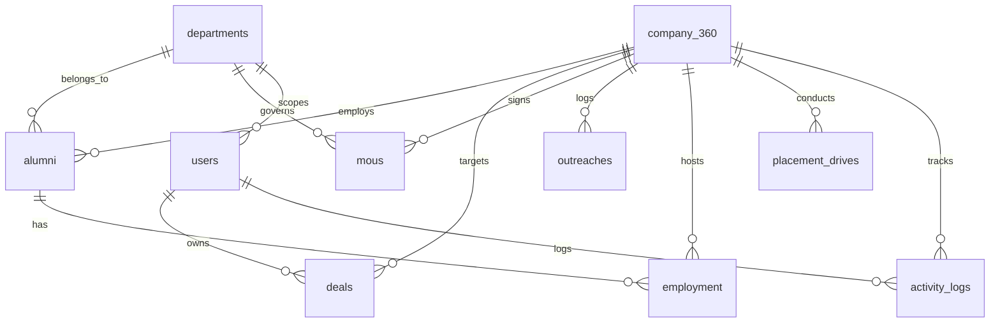

# TECHNICAL REQUIREMENTS DOCUMENT

**Project:** EduBridge Enterprise
**Document:** TRD — Technical Architecture & Implementation Guide
**Version:** 2.0 — Enterprise Suite
**Audience:** Development & DBA Teams
**Status:** Internal — Confidential
**Date:** 23 July 2026

> **CONFIDENTIAL – FOR INTERNAL USE ONLY**

---

## Document Revision History

| Version | Date | Description | Author |
|---------|------|-------------|--------|
| 2.0 | 23 Jul 2026 | Enterprise rewrite — new hierarchy, Gemini AI, web scraping, Kanban, No-Code, analytics schema, MERN-S stack | Project Lead |

---

## Table of Contents

1. [System Architecture](#1-system-architecture)
2. [Tech Stack Specifications](#2-tech-stack-specifications)
3. [MySQL Schema Design](#3-mysql-schema-design)
4. [API Architecture & Patterns](#4-api-architecture--patterns)
5. [Kanban Pipeline Engine](#5-kanban-pipeline-engine)
6. [Gemini AI Integration](#6-gemini-ai-integration)
7. [Web Scraping Engine](#7-web-scraping-engine)
8. [No-Code Card Designer](#8-no-code-card-designer)
9. [Security & RBAC Implementation](#9-security--rbac-implementation)
10. [Module Inventory & File Structure](#10-module-inventory--file-structure)

---

## 1. System Architecture

### 1.1 High-Level Architecture

```
┌─────────────────────────────────────────────────┐
│                  React SPA                        │
│         (Tailwind CSS, React Router,              │
│          DnD Kit, Chart.js, FullCalendar)         │
└─────────────────────┬───────────────────────────┘
                      │ HTTPS / JSON / JWT
┌─────────────────────▼───────────────────────────┐
│              Express.js 5.x REST API              │
│  ┌─────────┐ ┌──────────┐ ┌──────────────────┐  │
│  │ Auth MW │ │ RBAC MW  │ │ Rate Limiter     │  │
│  └─────────┘ └──────────┘ └──────────────────┘  │
│  ┌──────────────────────────────────────────┐   │
│  │         Route → Controller → Service     │   │
│  └──────────────────────────────────────────┘   │
└─────────────────────┬───────────────────────────┘
                      │
┌─────────────────────▼───────────────────────────┐
│         MySQL 8.0+ Relational Database            │
│  (Knex.js query builder, migrations, seed)       │
└─────────────────────┬───────────────────────────┘
                      │
┌─────────────────────▼───────────────────────────┐
│         External Services                         │
│  ┌──────────┐ ┌───────────┐ ┌────────────────┐  │
│  │Gemini API│ │ Puppeteer │ │ SMTP/SendGrid  │  │
│  └──────────┘ └───────────┘ └────────────────┘  │
└─────────────────────────────────────────────────┘
```

### 1.2 Request Lifecycle

```
Client → JWT Middleware → RBAC Middleware → Router → Controller → Service → DB/External API → Response Envelope → Client
```

### 1.3 Data Flow

- All data flows through the Express API layer
- Frontend never connects directly to MySQL
- Gemini API calls are proxied through backend (API key protected server-side)
- Web scraping runs as a background job with configurable schedule
- File uploads (MoU PDFs, card assets) are stored on local filesystem or S3-compatible storage

---

## 2. Tech Stack Specifications

### 2.1 Mandated Stack

| Layer | Technology | Version | Purpose |
|-------|------------|---------|---------|
| **Database** | MySQL | 8.0+ | Relational data storage |
| **Query Builder** | Knex.js | 3.x | SQL query construction, migrations, seeds |
| **Backend Runtime** | Node.js | 20 LTS | Server-side JavaScript runtime |
| **Backend Framework** | Express.js | 5.x | REST API framework |
| **Frontend** | React | 18+ | SPA user interface |
| **CSS** | Tailwind CSS | 3.x | Utility-first styling |
| **Auth** | JWT + bcrypt | — | Authentication and password hashing |

### 2.2 Frontend Libraries

| Library | Purpose |
|---------|---------|
| React Router v6 | Client-side routing |
| @dnd-kit/core + @dnd-kit/sortable | Kanban drag-and-drop |
| FullCalendar (React wrapper) | Placement Calendar view |
| Chart.js 4.x | Dashboard charts (package distribution, trends) |
| React-Beautiful-DnD | No-Code designer drag-and-drop |
| Axios | HTTP client for API calls |
| React Query / SWR | Server state management, caching |

### 2.3 Backend Libraries

| Library | Purpose |
|---------|---------|
| jsonwebtoken | JWT sign/verify |
| bcryptjs | Password hashing |
| nodemailer | Email sending |
| node-cron | Scheduled tasks (MoU expiry, scraping) |
| puppeteer | Web scraping engine |
| cheerio | HTML parsing for scraping |
| multer | File upload handling |
| dotenv | Environment variable management |
| helmet | HTTP security headers |
| express-rate-limit | API rate limiting |
| cors | Cross-origin resource sharing |

---

## 3. MySQL Schema Design

### 3.1 Schema Conventions

- **Primary Keys:** All tables use `CHAR(36)` UUID v4 as primary key (generated application-side via `uuid` package)
- **Timestamps:** `created_at` and `updated_at` columns on all tables with `DEFAULT CURRENT_TIMESTAMP` and `ON UPDATE CURRENT_TIMESTAMP`
- **Soft Deletes:** `deleted_at` nullable `TIMESTAMP` column on all data entities
- **Audit Fields:** `created_by` and `updated_by` as `CHAR(36)` nullable FK references to `users.id`
- **Naming:** Snake_case for columns, table names in plural (e.g., `company_360`, `deal_pipeline`)
- **Engine:** InnoDB for all tables (transaction support, foreign key enforcement)
- **Charset:** `utf8mb4` with `utf8mb4_unicode_ci` collation

### 3.2 Entity Relationship Diagram



### 3.3 Table Definitions

#### `users`

| Column | Type | Constraints | Description |
|--------|------|-------------|-------------|
| id | CHAR(36) | PK | UUID v4 |
| name | VARCHAR(255) | NOT NULL | Display name |
| email | VARCHAR(255) | UNIQUE, NOT NULL | Login identifier |
| password | VARCHAR(255) | NOT NULL | bcrypt hash |
| role | ENUM('admin','head','tpo','co_head','ebsc','rbsc','coordinator') | NOT NULL | Access level |
| department_id | CHAR(36) | FK → departments.id, NULL | Department scope (null = cross-dept) |
| reset_token | VARCHAR(255) | NULL | Password reset token |
| reset_token_expiry | TIMESTAMP | NULL | Reset token expiry |
| otp | VARCHAR(6) | NULL | Login OTP |
| otp_expiry | TIMESTAMP | NULL | OTP expiry |
| is_active | BOOLEAN | DEFAULT true | Active flag |
| created_at | TIMESTAMP | NOT NULL | |
| updated_at | TIMESTAMP | NOT NULL | |
| deleted_at | TIMESTAMP | NULL | Soft delete |

**Indexes:** `email`, `role`, `department_id`

#### `departments`

| Column | Type | Constraints | Description |
|--------|------|-------------|-------------|
| id | CHAR(36) | PK | UUID v4 |
| name | VARCHAR(100) | UNIQUE, NOT NULL | e.g., "Computer Engineering" |
| code | VARCHAR(10) | UNIQUE, NOT NULL | e.g., "COMP" |
| is_active | BOOLEAN | DEFAULT true | |
| created_at | TIMESTAMP | NOT NULL | |
| updated_at | TIMESTAMP | NOT NULL | |

#### `company_360`

| Column | Type | Constraints | Description |
|--------|------|-------------|-------------|
| id | CHAR(36) | PK | UUID v4 |
| company_code | VARCHAR(20) | UNIQUE, NOT NULL | Internal code |
| company_name | VARCHAR(255) | UNIQUE, NOT NULL | Legal name |
| industry | ENUM('IT','Finance','Healthcare','Manufacturing','Education','Consulting','Telecommunication','E_Commerce','Automobile','Construction','Other') | NOT NULL | |
| tier | ENUM('Tier_1','Tier_2','Tier_3') | DEFAULT 'Tier_3' | Premium / Standard / Emerging |
| website | VARCHAR(255) | NULL | |
| email | VARCHAR(255) | NULL | |
| phone | VARCHAR(20) | NULL | General phone |
| phone_number | VARCHAR(20) | NULL | Dedicated business line |
| linkedin | VARCHAR(255) | NULL | |
| head_office | VARCHAR(255) | NULL | |
| city | VARCHAR(255) | NULL | |
| country | VARCHAR(255) | DEFAULT 'India' | |
| postal_code | VARCHAR(15) | NULL | |
| company_size | ENUM('1_50','51_200','201_500','501_1000','1000_plus') | NULL | |
| founded_year | INT | NULL | |
| description | TEXT | NULL | |
| status | ENUM('ACTIVE','INACTIVE','PROSPECT','BLACKLISTED') | DEFAULT 'PROSPECT' | |
| partnership_level | ENUM('NONE','BASIC','PREMIUM','STRATEGIC') | DEFAULT 'NONE' | |
| relationship_stage | ENUM('Cold_Lead','Initial_Contact','Follow_Up','Meeting_Scheduled','Proposal_Sent','Negotiation','MoU_Discussion','MoU_Signed','Placement_Drive','Active_Partner','Strategic_Partner') | DEFAULT 'Cold_Lead' | |
| health_score | INT | DEFAULT 0 | 0-100 |
| next_follow_up_date | TIMESTAMP | NULL | Scheduled follow-up |
| total_placements | INT | DEFAULT 0 | Aggregate counter |
| total_offers | INT | DEFAULT 0 | Aggregate counter |
| total_visits | INT | DEFAULT 0 | Aggregate counter |
| total_mous | INT | DEFAULT 0 | Aggregate counter |
| hire_key | ENUM('Head','Co_Head') | NULL | Relationship owner level |
| created_by | CHAR(36) | FK → users.id | |
| updated_by | CHAR(36) | FK → users.id | |
| is_active | BOOLEAN | DEFAULT true | |
| created_at | TIMESTAMP | NOT NULL | |
| updated_at | TIMESTAMP | NOT NULL | |
| deleted_at | TIMESTAMP | NULL | |

**Indexes:** `city`, `health_score`, `industry`, `next_follow_up_date`, `partnership_level`, `relationship_stage`, `status`, `tier`

#### `deals` (Deal Pipeline)

| Column | Type | Constraints | Description |
|--------|------|-------------|-------------|
| id | CHAR(36) | PK | UUID v4 |
| deal_code | VARCHAR(20) | UNIQUE, NOT NULL | Internal code |
| company_id | CHAR(36) | FK → company_360.id, NOT NULL | |
| title | VARCHAR(255) | NOT NULL | Deal title |
| owner_id | CHAR(36) | FK → users.id, NOT NULL | |
| stage | ENUM('Cold_Lead','Initial_Contact','Follow_Up','Meeting_Scheduled','Proposal_Sent','Negotiation','MoU_Discussion','MoU_Signed','Placement_Drive','Active_Partner','Strategic_Partner') | DEFAULT 'Cold_Lead' | |
| priority | ENUM('Low','Medium','High','Critical') | DEFAULT 'Medium' | |
| probability | INT | DEFAULT 10 | Win probability % |
| current_status | ENUM('On_Track','At_Risk','Stalled','Won','Lost') | DEFAULT 'On_Track' | Real-time health |
| expected_students | INT | DEFAULT 0 | |
| expected_ctc | DECIMAL(10,2) | NULL | |
| expected_hiring_date | DATE | NULL | |
| source | ENUM('Web_Scrape','Referral','Inbound','Event','TPO_Outreach','Other') | DEFAULT 'Other' | |
| lead_owner | VARCHAR(255) | NULL | External lead name |
| decision_maker | VARCHAR(255) | NULL | |
| decision_maker_email | VARCHAR(255) | NULL | |
| decision_maker_phone | VARCHAR(20) | NULL | |
| last_activity_date | TIMESTAMP | NULL | |
| next_follow_up_date | TIMESTAMP | NULL | |
| next_action | VARCHAR(255) | NULL | |
| meeting_date | TIMESTAMP | NULL | |
| proposal_sent_date | TIMESTAMP | NULL | |
| mou_expected_date | TIMESTAMP | NULL | |
| close_date | TIMESTAMP | NULL | |
| lost_reason | TEXT | NULL | |
| competitor_college | VARCHAR(255) | NULL | |
| risk_level | ENUM('Low','Medium','High') | DEFAULT 'Low' | |
| remarks | TEXT | NULL | |
| is_archived | BOOLEAN | DEFAULT false | |
| created_by | CHAR(36) | FK → users.id | |
| updated_by | CHAR(36) | FK → users.id | |
| created_at | TIMESTAMP | NOT NULL | |
| updated_at | TIMESTAMP | NOT NULL | |
| deleted_at | TIMESTAMP | NULL | |

**Indexes:** `company_id`, `owner_id`, `stage`, `priority`, `probability`, `current_status`, `next_follow_up_date`, `expected_hiring_date`

#### `deal_stage_history`

| Column | Type | Constraints | Description |
|--------|------|-------------|-------------|
| id | CHAR(36) | PK | |
| deal_id | CHAR(36) | FK → deals.id, NOT NULL | |
| previous_stage | VARCHAR(50) | NULL | |
| new_stage | VARCHAR(50) | NOT NULL | |
| changed_by | CHAR(36) | FK → users.id | |
| created_at | TIMESTAMP | NOT NULL | |

**Indexes:** `deal_id`

#### `mous`

| Column | Type | Constraints | Description |
|--------|------|-------------|-------------|
| id | CHAR(36) | PK | |
| company_id | CHAR(36) | FK → company_360.id, NOT NULL | |
| department_id | CHAR(36) | FK → departments.id, NULL | |
| mou_number | VARCHAR(50) | UNIQUE, NOT NULL | |
| title | VARCHAR(255) | NOT NULL | |
| purpose | TEXT | NULL | |
| start_date | DATE | NOT NULL | |
| end_date | DATE | NOT NULL | |
| signed_date | DATE | NOT NULL | |
| status | ENUM('DRAFT','PENDING','ACTIVE','EXPIRED','TERMINATED','RENEWED') | DEFAULT 'DRAFT' | |
| collaboration_type | ENUM('PLACEMENTS','INTERNSHIPS','TRAINING','RESEARCH','CONSULTANCY','INDUSTRY_VISIT','WORKSHOP','MULTIPLE','OTHER') | NOT NULL | |
| deliverable_type | ENUM('PART_A_SEMINARS','PART_B_HIGHER_STUDIES','BOTH') | DEFAULT 'PART_A_SEMINARS' | |
| signed_by_company | VARCHAR(255) | NULL | |
| signed_by_institute | VARCHAR(255) | NULL | |
| renewal_reminder_days | INT | DEFAULT 30 | |
| document_url | VARCHAR(255) | NULL | PDF path |
| remarks | TEXT | NULL | |
| created_by | CHAR(36) | FK → users.id | |
| updated_by | CHAR(36) | FK → users.id | |
| created_at | TIMESTAMP | NOT NULL | |
| updated_at | TIMESTAMP | NOT NULL | |
| deleted_at | TIMESTAMP | NULL | |

**Indexes:** `company_id`, `department_id`, `end_date`, `status`, `deliverable_type`

#### `alumni`

| Column | Type | Constraints | Description |
|--------|------|-------------|-------------|
| id | CHAR(36) | PK | |
| alumni_code | VARCHAR(20) | UNIQUE, NOT NULL | |
| full_name | VARCHAR(255) | NOT NULL | |
| email | VARCHAR(255) | UNIQUE, NOT NULL | |
| phone | VARCHAR(20) | NULL | |
| department_id | CHAR(36) | FK → departments.id, NOT NULL | |
| batch_year | INT | NOT NULL | |
| current_designation | VARCHAR(150) | NOT NULL | |
| seniority_level | ENUM('Entry_Level','Mid_Level','Senior_Level','Lead','Manager','Director','Founder','HR','Other') | DEFAULT 'Entry_Level' | |
| company_id | CHAR(36) | FK → company_360.id, NULL | |
| linkedin | VARCHAR(255) | NULL | |
| location | VARCHAR(255) | NULL | |
| skills | JSON | DEFAULT '[]' | |
| willingness_to_help | ENUM('Yes','No','Maybe') | DEFAULT 'Maybe' | |
| help_types | JSON | DEFAULT '[]' | |
| influence_score | INT | DEFAULT 0 | 0-100 |
| relationship_score | INT | DEFAULT 0 | 0-100 |
| last_contacted_at | TIMESTAMP | NULL | |
| status | ENUM('Active','Inactive','Not_Reachable') | DEFAULT 'Active' | |
| notes | TEXT | NULL | |
| created_at | TIMESTAMP | NOT NULL | |
| updated_at | TIMESTAMP | NOT NULL | |

**Indexes:** `company_id`, `department_id`, `batch_year`, `seniority_level`, `willingness_to_help`

#### `employment`

| Column | Type | Constraints | Description |
|--------|------|-------------|-------------|
| id | CHAR(36) | PK | |
| alumni_id | CHAR(36) | FK → alumni.id, NOT NULL | |
| company_id | CHAR(36) | FK → company_360.id, NOT NULL | |
| designation | VARCHAR(255) | NOT NULL | |
| department | VARCHAR(100) | NULL | |
| start_date | DATE | NOT NULL | |
| end_date | DATE | NULL | NULL = current |
| is_current | BOOLEAN | DEFAULT true | |
| employment_type | ENUM('FULL_TIME','PART_TIME','CONTRACT','INTERNSHIP') | DEFAULT 'FULL_TIME' | |
| work_mode | ENUM('ON_SITE','REMOTE','HYBRID') | DEFAULT 'ON_SITE' | |
| location | VARCHAR(255) | NULL | |
| description | TEXT | NULL | |
| remarks | TEXT | NULL | |
| created_at | TIMESTAMP | NOT NULL | |
| updated_at | TIMESTAMP | NOT NULL | |

**Indexes:** `alumni_id`, `company_id`, `(alumni_id, is_current)`, `(company_id, is_current)`

#### `outreaches`

| Column | Type | Constraints | Description |
|--------|------|-------------|-------------|
| id | CHAR(36) | PK | |
| company_id | CHAR(36) | FK → company_360.id, NOT NULL | |
| type | ENUM('EMAIL','PHONE_CALL','MEETING','LINKEDIN','VISIT','EVENT','PLACEMENT_DRIVE','INTERNSHIP','MOU_DISCUSSION','FOLLOW_UP','OTHER') | NOT NULL | |
| subject | VARCHAR(255) | NOT NULL | |
| description | TEXT | NULL | |
| interaction_date | TIMESTAMP | NOT NULL | |
| outcome | ENUM('POSITIVE','NEUTRAL','NEGATIVE','NO_RESPONSE','FOLLOW_UP_REQUIRED') | DEFAULT 'NEUTRAL' | |
| status | ENUM('PLANNED','COMPLETED','CANCELLED','MISSED') | DEFAULT 'PLANNED' | |
| next_follow_up_date | TIMESTAMP | NULL | |
| notes | TEXT | NULL | |
| created_by | CHAR(36) | FK → users.id, NOT NULL | |
| updated_by | CHAR(36) | FK → users.id | |
| created_at | TIMESTAMP | NOT NULL | |
| updated_at | TIMESTAMP | NOT NULL | |
| deleted_at | TIMESTAMP | NULL | |

**Indexes:** `company_id`, `type`, `interaction_date`, `outcome`, `status`, `next_follow_up_date`

#### `placement_drives`

| Column | Type | Constraints | Description |
|--------|------|-------------|-------------|
| id | CHAR(36) | PK | |
| company_id | CHAR(36) | FK → company_360.id, NOT NULL | |
| department_id | CHAR(36) | FK → departments.id, NULL | |
| drive_date | DATE | NOT NULL | |
| job_title | VARCHAR(255) | NOT NULL | |
| students_appeared | INT | DEFAULT 0 | |
| students_selected | INT | DEFAULT 0 | |
| package | DECIMAL(10,2) | NULL | Highest LPA offered |
| notes | TEXT | NULL | |
| created_at | TIMESTAMP | NOT NULL | |
| updated_at | TIMESTAMP | NOT NULL | |

**Indexes:** `company_id`, `department_id`, `drive_date`

#### `activity_logs`

| Column | Type | Constraints | Description |
|--------|------|-------------|-------------|
| id | CHAR(36) | PK | |
| company_id | CHAR(36) | FK → company_360.id, NOT NULL | |
| type | ENUM('CALL','EMAIL','MEETING','NOTE') | NOT NULL | |
| subject | VARCHAR(255) | NOT NULL | |
| description | TEXT | NULL | |
| performed_by | CHAR(36) | FK → users.id, NOT NULL | |
| created_at | TIMESTAMP | NOT NULL | |

**Indexes:** `company_id`, `performed_by`, `type`

#### `card_templates`

| Column | Type | Constraints | Description |
|--------|------|-------------|-------------|
| id | CHAR(36) | PK | |
| name | VARCHAR(255) | NOT NULL | Template name |
| category | VARCHAR(100) | NULL | e.g., "Outreach", "Offer" |
| config | JSON | NOT NULL | Component tree and styles |
| thumbnail | VARCHAR(255) | NULL | Preview image path |
| is_published | BOOLEAN | DEFAULT false | Org-approved |
| created_by | CHAR(36) | FK → users.id | |
| created_at | TIMESTAMP | NOT NULL | |
| updated_at | TIMESTAMP | NOT NULL | |
| deleted_at | TIMESTAMP | NULL | |

**Indexes:** `category`, `is_published`

#### `scraped_leads`

| Column | Type | Constraints | Description |
|--------|------|-------------|-------------|
| id | CHAR(36) | PK | |
| source_url | VARCHAR(500) | NOT NULL | |
| company_name | VARCHAR(255) | NOT NULL | |
| industry | VARCHAR(100) | NULL | |
| website | VARCHAR(255) | NULL | |
| email | VARCHAR(255) | NULL | |
| phone | VARCHAR(20) | NULL | |
| location | VARCHAR(255) | NULL | |
| status | ENUM('PENDING','APPROVED','REJECTED','DUPLICATE') | DEFAULT 'PENDING' | |
| matched_company_id | CHAR(36) | FK → company_360.id, NULL | If duplicate |
| reviewed_by | CHAR(36) | FK → users.id, NULL | |
| reviewed_at | TIMESTAMP | NULL | |
| created_at | TIMESTAMP | NOT NULL | |

**Indexes:** `status`, `company_name`

### 3.4 Migration Strategy

- All schema changes via Knex.js migration files
- File naming convention: `YYYYMMDDHHMMSS_description.js`
- Seed files for default departments and admin user
- Rollback supported for all migrations

---

## 4. API Architecture & Patterns

### 4.1 Standardised Response Envelope

Success:
```json
{
  "success": true,
  "data": { ... },
  "pagination": {
    "page": 1,
    "limit": 20,
    "total": 142,
    "totalPages": 8
  },
  "message": null
}
```

Error:
```json
{
  "success": false,
  "data": null,
  "message": "Human-readable error description"
}
```

HTTP Status Codes: `200` (success), `201` (created), `400` (validation), `401` (unauthenticated), `403` (forbidden), `404` (not found), `409` (conflict), `429` (rate limited), `500` (internal).

### 4.2 API Module Map

| Module | Base Path | Controller | Service |
|--------|-----------|------------|---------|
| Auth | `/auth` | authController | authService |
| Users | `/api/users` | userController | userService |
| Companies | `/api/company360` | companyController | companyService |
| Deals | `/api/deals` | dealController | dealService |
| MoUs | `/api/mou` | mouController | mouService |
| Alumni | `/api/alumni` | alumniController | alumniService |
| Employment | `/api/employment` | employmentController | employmentService |
| Outreach | `/api/outreach` | outreachController | outreachService |
| Drives | `/api/drives` | driveController | driveService |
| Activity Logs | `/api/activity-logs` | activityLogController | activityLogService |
| Analytics | `/api/analytics` | analyticsController | analyticsService |
| Dashboard | `/api/dashboard` | dashboardController | dashboardService |
| TPO Sync | `/api/tpo` | tpoSyncController | tpoSyncService |
| AI | `/api/ai` | aiController | aiService |
| Scraper | `/api/scraper` | scraperController | scraperService |
| Templates | `/api/templates` | templateController | templateService |
| Departments | `/api/departments` | departmentController | departmentService |

### 4.3 Key Endpoint Definitions

#### `GET /api/deals/kanban`
Returns deals grouped by stage for Kanban board rendering.

Query params: `?stage=`, `?priority=`, `?owner_id=`, `?company_id=`, `?current_status=`

Response:
```json
{
  "success": true,
  "data": {
    "columns": [
      {
        "stage": "Cold_Lead",
        "title": "Cold Lead",
        "deals": [
          {
            "id": "uuid",
            "title": "Google Partnership",
            "company": { "id": "uuid", "company_name": "Google" },
            "priority": "High",
            "probability": 10,
            "expected_ctc": 2500000,
            "next_action": "Send intro email",
            "current_status": "On_Track",
            "owner": { "id": "uuid", "name": "John" }
          }
        ]
      }
    ]
  }
}
```

#### `PATCH /api/deals/:id/stage`
Changes deal stage. Triggers: probability auto-update, stage history entry, activity log creation.

Request: `{ "stage": "Meeting_Scheduled" }`

#### `POST /api/ai/generate-email`
Generates personalized email via Gemini API.

Request:
```json
{
  "company_name": "Google",
  "recipient_name": "John Doe",
  "context": "Campus placement collaboration for 2026-27",
  "tone": "professional"
}
```

Response:
```json
{
  "success": true,
  "data": {
    "subject": "Campus Partnership Opportunity with VPPCOE",
    "body": "Dear John... [AI-generated content]"
  }
}
```

#### `POST /api/scraper/run`
Triggers web scraping job manually.

Response: `{ "success": true, "data": { "job_id": "uuid", "leads_discovered": 15 } }`

#### `POST /api/tpo/sync-student-counts`
Ingests placement drive data.

Request:
```json
{
  "company_id": "uuid",
  "drive_date": "2026-08-15",
  "job_title": "Software Engineer",
  "students_appeared": 45,
  "students_selected": 12,
  "package": 1200000
}
```

#### `GET /api/dashboard/institutional`
Returns aggregate KPIs for the executive dashboard.

Response:
```json
{
  "success": true,
  "data": {
    "total_students": 5000,
    "highest_package_current_year": 2500000,
    "highest_package_all_time": 3200000,
    "average_package": 650000,
    "median_package": 550000,
    "package_distribution": [
      { "company": "Google", "students": 12, "avg_package": 2400000 }
    ],
    "active_mous": 45,
    "deals_by_stage": { "Cold_Lead": 20, "MoU_Signed": 8 },
    "upcoming_drives": 5
  }
}
```

---

## 5. Kanban Pipeline Engine

### 5.1 Stage Configuration

The pipeline consists of 11 stages. Each stage has configurable properties:

| Stage | Default Probability | Color | Description |
|-------|-------------------|-------|-------------|
| Cold_Lead | 5% | gray | Initial discovery, no contact made |
| Initial_Contact | 10% | blue | First outreach sent |
| Follow_Up | 15% | indigo | Follow-up after initial contact |
| Meeting_Scheduled | 25% | purple | Meeting confirmed on calendar |
| Proposal_Sent | 35% | violet | Partnership proposal delivered |
| Negotiation | 50% | orange | Terms under discussion |
| MoU_Discussion | 60% | amber | MoU draft being reviewed |
| MoU_Signed | 75% | yellow | Agreement executed |
| Placement_Drive | 85% | lime | Hiring event completed |
| Active_Partner | 95% | green | Ongoing hiring relationship |
| Strategic_Partner | 100% | emerald | Premium long-term partner |

### 5.2 Stage Change Logic

```
On stage change:
  1. Validate transition (stages can move forward or backward)
  2. Update deal.probability to stage default
  3. Update deal.current_status logic:
     - If stage moves forward → "On_Track"
     - If no activity in 30 days → "At_Risk"
     - If stage unchanged for 60+ days → "Stalled"
  4. Insert deal_stage_history record
  5. Create activity_log entry
  6. If stage = "MoU_Signed", create MoU draft record
  7. If stage = "Placement_Drive", create PlacementDrive skeleton
```

### 5.3 Current Status Auto-Calculation

| Condition | Status |
|-----------|--------|
| Stage changed within last 30 days | On_Track |
| No stage change in 30-60 days or follow-up overdue | At_Risk |
| No stage change in 60+ days | Stalled |
| deal status = WON | Won |
| deal status = LOST | Lost |

---

## 6. Gemini AI Integration

### 6.1 Architecture

```
Client → POST /api/ai/generate-email → aiController → aiService → Gemini API → Parse Response → Return to Client
```

### 6.2 Prompt Engineering

The system constructs a structured prompt for Gemini:

```
You are an assistant for a university Training and Placement Office.
Generate a professional outreach email to a company for campus placement collaboration.

Company Name: {company_name}
Recipient Name: {recipient_name}
Context: {context}
Tone: {tone}

The email should:
1. Have a compelling subject line
2. Introduce the institution and TPO office
3. Reference the specific context provided
4. Include a clear call to action
5. Be signed from the TPO office

Return JSON format:
{ "subject": "...", "body": "..." }
```

### 6.3 Error Handling

| Scenario | Handling |
|----------|----------|
| API timeout (> 10s) | Retry once, then fall back to template editor |
| Rate limit (429) | Queue request, retry after delay |
| Invalid response | Log error, return manual template |
| API key missing | Return 500 with configuration error message |

### 6.4 Rate Limiting

- Max 10 requests per minute per user
- Max 100 requests per hour per IP
- Configurable via environment variables

---

## 7. Web Scraping Engine

### 7.1 Architecture

```
node-cron trigger → Scraper Service → Puppeteer Browser → Target URLs → Parse HTML → Dedup → Insert scraped_leads → Notify
```

### 7.2 Pipeline

1. **Scheduler:** `node-cron` triggers scraper daily at configurable time (default: 02:00)
2. **Source Targets:** Configurable list of job portals and company listing pages
3. **Extraction:** Puppeteer loads page, Cheerio parses HTML, extracts: company_name, industry, website, email, phone, location
4. **Deduplication:** Compare extract company_name against existing `company_360` and `scraped_leads` tables using Levenshtein distance (threshold: 0.8)
5. **Insert:** New leads written to `scraped_leads` with status "PENDING"
6. **Notification:** TPO staff notified of new leads via in-app alert
7. **Review Queue:** TPO/Head reviews, approves (creates company_360 record), rejects, or marks as duplicate

### 7.3 Configuration

```env
SCRAPER_ENABLED=true
SCRAPER_SCHEDULE="0 2 * * *"        # Daily at 2 AM
SCRAPER_RATE_LIMIT_MS=200            # 5 requests/sec per domain
SCRAPER_TIMEOUT_MS=30000             # 30s page timeout
SCRAPER_MAX_PAGES_PER_RUN=500
SCRAPER_SOURCES='["https://..." ]'   # JSON array of target URLs
```

### 7.4 Ethical Compliance

- Respects `robots.txt` directives
- Configurable delay between requests per domain
- User-Agent header set to identify the scraper
- Only targets publicly accessible data

---

## 8. No-Code Card Designer

### 8.1 Architecture

```
React DnD Canvas → Component Tree (JSON) → Preview Renderer → Save as Template
```

### 8.2 Component Model

Each template is stored as a JSON `config` object:

```json
{
  "version": 1,
  "width": 400,
  "height": 600,
  "components": [
    {
      "id": "comp_1",
      "type": "header",
      "props": {
        "text": "Partnership Opportunity",
        "fontSize": 24,
        "fontWeight": "bold",
        "color": "#1e3a5f",
        "alignment": "center"
      },
      "position": { "x": 0, "y": 0, "w": 400, "h": 60 }
    },
    {
      "id": "comp_2",
      "type": "image",
      "props": {
        "src": "https://...",
        "alt": "College Logo",
        "borderRadius": 8
      },
      "position": { "x": 140, "y": 70, "w": 120, "h": 120 }
    },
    {
      "id": "comp_3",
      "type": "text",
      "props": {
        "text": "Dear {{recipient_name}},",
        "fontSize": 16,
        "color": "#333333",
        "lineHeight": 1.5
      },
      "position": { "x": 20, "y": 200, "w": 360, "h": 80 }
    },
    {
      "id": "comp_4",
      "type": "button",
      "props": {
        "text": "Schedule a Meeting",
        "backgroundColor": "#1e3a5f",
        "textColor": "#ffffff",
        "borderRadius": 6,
        "url": "https://...",
        "fontSize": 14
      },
      "position": { "x": 100, "y": 320, "w": 200, "h": 44 }
    },
    {
      "id": "comp_5",
      "type": "divider",
      "props": {
        "color": "#e0e0e0",
        "thickness": 1,
        "marginTop": 20,
        "marginBottom": 20
      },
      "position": { "x": 20, "y": 380, "w": 360, "h": 2 }
    },
    {
      "id": "comp_6",
      "type": "footer",
      "props": {
        "text": "EduBridge Enterprise — VPPCOE",
        "fontSize": 12,
        "color": "#999999",
        "alignment": "center"
      },
      "position": { "x": 0, "y": 420, "w": 400, "h": 40 }
    }
  ]
}
```

### 8.3 Available Components

| Component | Props | Description |
|-----------|-------|-------------|
| Header | text, fontSize, fontWeight, color, alignment | Bold title text |
| Text | text, fontSize, color, lineHeight, alignment | Paragraph/body text |
| Image | src, alt, borderRadius, border | Image with optional border radius |
| Button | text, backgroundColor, textColor, borderRadius, url, fontSize | CTA button (link or action) |
| Divider | color, thickness, marginTop, marginBottom | Horizontal separator |
| Badge | text, backgroundColor, textColor, borderRadius | Tag/badge component |
| Icon | name, size, color | Material icon |
| Spacer | height | Empty vertical space |

### 8.4 Template Variables

Templates support variable interpolation using `{{variable_name}}` syntax:

- `{{recipient_name}}` — Company contact name
- `{{company_name}}` — Company name
- `{{institution_name}}` — College name
- `{{tpo_name}}` — Sender TPO name
- `{{current_year}}` — Current year

---

## 9. Security & RBAC Implementation

### 9.1 JWT Authentication

```
Token payload: { id, email, role, department_id }
Signing: JWT.sign(payload, JWT_SECRET, { expiresIn: '24h' })
Verification: authenticate middleware extracts Bearer token, verifies, attaches req.user
```

### 9.2 RBAC Middleware

| Middleware | Gate Logic |
|-----------|------------|
| `authenticate` | Verifies JWT, attaches `req.user` |
| `authorize(...roles)` | Checks `req.user.role` is in allowed roles array |
| `scopeDepartment` | For Coordinator: auto-filters queries to `department_id` |

### 9.3 Role Hierarchy Enforcement

```javascript
const ROLE_HIERARCHY = {
  admin: 100,
  head: 80,
  tpo: 70,
  co_head: 60,
  ebsc: 50,
  rbsc: 40,
  coordinator: 30
};

function hasMinRole(userRole, requiredMinRole) {
  return ROLE_HIERARCHY[userRole] >= ROLE_HIERARCHY[requiredMinRole];
}
```

### 9.4 Department Scoping

- Users with `department_id` set (Coordinators) have queries auto-filtered:
  - `WHERE department_id = req.user.department_id` for MoUs, alumni, drives
  - Companies: no department filter (companies are cross-department)
- Users with `department_id = NULL` (Head, TPO, Co-Head, EBSC, RBSC, Admin) see all data

### 9.5 Security Headers

Implemented via `helmet` middleware:
- Content-Security-Policy
- X-Content-Type-Options: nosniff
- X-Frame-Options: DENY
- Strict-Transport-Security

---

## 10. Module Inventory & File Structure

### 10.1 Project Structure

```
edubridge-enterprise/
├── backend/
│   ├── src/
│   │   ├── server.js                    # Express bootstrap
│   │   ├── config/
│   │   │   ├── db.js                    # Knex connection
│   │   │   ├── jwt.js                   # JWT helpers
│   │   │   └── gemini.js                # Gemini API config
│   │   ├── middleware/
│   │   │   ├── authenticate.js          # JWT verification
│   │   │   ├── authorize.js             # Role-based gate
│   │   │   └── scopeDepartment.js       # Department filter
│   │   ├── routes/
│   │   │   ├── auth.js
│   │   │   ├── users.js
│   │   │   ├── companies.js
│   │   │   ├── deals.js
│   │   │   ├── mous.js
│   │   │   ├── alumni.js
│   │   │   ├── employment.js
│   │   │   ├── outreach.js
│   │   │   ├── drives.js
│   │   │   ├── activityLogs.js
│   │   │   ├── analytics.js
│   │   │   ├── dashboard.js
│   │   │   ├── tpoSync.js
│   │   │   ├── ai.js
│   │   │   ├── scraper.js
│   │   │   ├── templates.js
│   │   │   └── departments.js
│   │   ├── controllers/
│   │   ├── services/
│   │   │   ├── aiService.js             # Gemini API integration
│   │   │   ├── scraperService.js        # Puppeteer scraping engine
│   │   │   ├── kanbanService.js         # Stage logic, current status calc
│   │   │   ├── mouService.js            # MoU CRUD + expiry alerts
│   │   │   ├── analyticsService.js      # Aggregation queries
│   │   │   └── ...
│   │   └── utils/
│   │       └── email.js                 # Nodemailer transporter
│   ├── migrations/                      # Knex migration files
│   ├── seeds/                           # Default data seeds
│   └── package.json
├── frontend/
│   ├── src/
│   │   ├── components/
│   │   │   ├── KanbanBoard/
│   │   │   ├── Calendar/
│   │   │   ├── CardDesigner/
│   │   │   ├── Dashboard/
│   │   │   └── Directory/
│   │   ├── pages/
│   │   ├── hooks/
│   │   ├── services/                    # API client functions
│   │   └── utils/
│   └── package.json
├── docker-compose.yml
├── .env.example
├── PVD.md
├── PRD.md
├── SRS.md
├── TRD.md
├── ROLES.md
└── README.md
```

### 10.2 Service-to-Table Mapping

| Service | Primary Table | Secondary Tables |
|---------|---------------|------------------|
| authService | users | — |
| userService | users | departments |
| companyService | company_360 | — |
| dealService | deals | deal_stage_history, company_360, users |
| mouService | mous | company_360, departments |
| alumniService | alumni | company_360, departments, employment |
| employmentService | employment | alumni, company_360 |
| outreachService | outreaches | company_360 |
| driveService | placement_drives | company_360, departments |
| activityLogService | activity_logs | company_360, users |
| analyticsService | company_360, placement_drives, mous | — |
| dashboardService | company_360, placement_drives, mous, deals | — |
| tpoSyncService | placement_drives | company_360 |
| aiService | — (external Gemini API) | outreaches, activity_logs |
| scraperService | scraped_leads | company_360 |
| templateService | card_templates | — |
| departmentService | departments | users |

### 10.3 Key Implementation Notes

- **Kanban Stage Change:** Each stage change inserts a `deal_stage_history` row and updates `current_status` based on recency heuristics
- **MoU Expiry Scan:** A `node-cron` job runs daily at midnight, queries `mous WHERE end_date BETWEEN NOW() AND NOW() + INTERVAL renewal_reminder_days DAY`, and creates notifications for the TPO/Head and the relevant Coordinator
- **Activity Log Auto-Creation:** Every outreach completion, deal stage change, AI email generation, and drive creation auto-creates an activity log entry
- **Aggregate Counters:** Company360's `total_placements`, `total_offers`, `total_visits`, `total_mous` are updated via triggers in the service layer (not DB triggers) when related records are created/deleted
- **Duplicate Detection:** Web scraping deduplication uses Levenshtein distance on company names with a threshold of 0.8; manual review for near-matches
- **Department Scoping:** All Coordinator queries are automatically filtered by `department_id` via the `scopeDepartment` middleware
